# --- PYTHON ÇEVRİMDIŞI EL KİTABI ---
## --- PYTHON BASLAYIP BITIRME PLANI ---
1--Bölüm 2--Tahmini Süre 3--Odak Noktası 4--Neden Önemli?
1.1 Kısım: Temeller	5 - 7 Hafta	Döngüler, Karar Yapıları, Fonksiyonlar.	 Bu kısım senin temelin. Burası ne kadar sürerse sürsün (ister 5 ister 7 hafta), tam oturmadan geçmeyeceğiz.
2. Kısım: Profesyonellik	8 - 10 Hafta	OOP (Nesne Yönelimli Programlama), Hata Yönetimi, Dosyalar.	Backend'in kalbi burasıdır. Karmaşık sistemleri yönetmeyi burada öğreneceksin.
3. Kısım: Uzmanlık & Veri	12 - 14 Hafta	SQL, Veritabanları, API Mantığı ve Projeler.	Bilgiyi kalıcı hale getirip gerçek dünya uygulamalarına döktüğün yer.

## --- KUCUK GIRIS VE BILGI ---
### --- PYTHON'IN MANTIĞI VE ÇALIŞMA SİSTEMİ --- [0.1.0-0.1.9]
```PY
0.1.0 Python Nasıl Çalışır  (Yorumlayıcı Mantığı)
0.1.1 Python, "Interpreted" (Yorumlanan) bir dildir.

0.1.2 Mantık: Sen kodu yazdığında, bir "Yorumlayıcı" (Interpreter) kodu satır satır okur ve o an bilgisayara ne yapması gerektiğini söyler.

0.1.3 Farkı: C++ gibi diller önce tüm kodu bir "pakete" (exe dosyasına) dönüştürür, sonra çalıştırır. Python ise doğrudan satırı okur ve çalıştırır. Bu da hata bulmayı çok hızlandırır.

0.1.4 Python Bilgisayarı Nasıl Anlar?
Bilgisayarlar aslında sadece 0 ve 1 (elektrik var/yok) mantığıyla çalışır.

0.1.5 Süreç: Yazdığın print("Merhaba") kodu, önce Bytecode denilen bir ara forma, sonra da bilgisayarın işlemcisinin anlayacağı Makine Diline (0-1) dönüştürülür.

0.1.6 Kolaylık: Sen karmaşık 0-1 dünyasıyla uğraşmazsın, Python senin yerine bu çeviriyi yapar.

0.1.7 Diğer Dillerden Farkı Nedir?
Okunabilirlik: Python, İngilizceye en yakın dildir. C++'ta 10 satırda yapacağın işi Python'da 2 satırda yapabilirsin.

0.1.8 Hız vs. Kolaylık: C++ daha hızlı çalışır (donanıma yakındır) ama Python ile uygulama geliştirmek çok daha hızlıdır.

0.1.9 Kütüphaneler: Python'ın her şey için hazır bir "modülü" vardır. Tekerleği her seferinde yeniden icat etmene gerek kalmaz.
```
### --- KOD ORGANİZASYONU VE SIRALAMA DİSİPLİNİ --- [0.2.0-0.3.3]
```PY
0.2.0 Python kodu bir inşaat gibidir; önce temeli atmalı, sonra katları çıkmalı ve en son dekorasyonu yapmalısın. 

0.2.1 Python yukarıdan aşağıya (top-to-bottom) okuma yaptığı için sıralama hayati önem taşır.

0.2.2 Kat: Kütüphaneler (Imports)
Detay: Programına dışarıdan süper güçler eklediğin yerdir.

0.2.2 Küçük Örnek:
import math # Matematiksel formülleri getirir
import random # Rastgele sayı üretme yeteneği getirir

0.2.3 Kat: Sabitler ve Değişkenler (Variables)
Detay: Kodun her yerinde kullanacağın ana verileri burada tanımlarsın.

0.2.4 Küçük Örnek:
kullanici_adi = "Dawut"
hedef_ulke = "Avusturya"
python_notlari = [90, 100, 95]

0.2.5 Kat: Fonksiyonlar (Functions)
0.2.6 Detay: Bir işi yapan "mini makinelerdir". Onları burada kurarsın ama henüz düğmesine basmazsın.

0.2.7 Küçük Örnek:
def selamla():
    print("Merhaba Mühendis Dawut!")

0.2.8 Kat: Ana Çalıştırma Alanı (The Main Loop / Execution)
0.2.9 Detay: Yukarıda hazırladığın her şeyi burada birleştirirsin. Kodun aslında "başladığı" yer burasıdır.

0.3.0 Küçük Örnek:
selamla() # Yukarıdaki fonksiyonu şimdi çağırdık
print(kullanici_adi + " için kod çalışıyor...")

# --- BÜYÜK MÜHENDİSLİK ÖRNEĞİ (Hepsini Birleştiriyoruz)
0.3.1 Bu örnekte bir öğrencinin Python notlarını hesaplayan ve sıralayan tam bir kod yapısı görmekteyiz

0.3.2 Büyük Örnek:
# --- 1. KÜTÜPHANELER ---
import math # Karmaşık hesap gerekirse hazırda dursun

# --- 2. DEĞİŞKENLER (VERİLER) ---
ogrenci_adi = "Dawut Gociyew"
ders_notlari = [85, 95, 100, 70] # Python sınav sonuçları

# --- 3. FONKSİYONLAR (İŞLEMLER) ---
def notlari_duzenle(liste):
    """Notları büyükten küçüğe sıralayan fonksiyon"""
    liste.sort(reverse=True)
    return liste

def ortalama_hesapla(liste):
    """Notların ortalamasını bulan fonksiyon"""
    toplam = sum(liste)
    adet = len(liste)
    return toplam / adet

# --- 4. ANA ÇALIŞTIRMA (SONUÇ) ---
print("--- Sistem Başlatılıyor ---")

# Fonksiyonları kullanıyoruz
sirali_liste = notlari_duzenle(ders_notlari)
ortalama = ortalama_hesapla(ders_notlari)

# Ekrana yazdırma
print("Öğrenci:", ogrenci_adi)
print("Sıralı Notların:", sirali_liste)
print("Başarı Ortalaman:", ortalama)

if ortalama > 80:
    print("Durum: Harika! Mühendislik için hazırsın.")


0.3.4 # --- BIRLESTIRILMIS BUYUK ORNEGI ---


# --- Degiskenler ---
SINIR_KAPISI_ADI = "Arztorzka Dogu Sinir Kapisi"
MAX_GIRIS_DENEMESI = 3
YAS_SINIRI = 18
MIN_BANKA_BAKIYESI = 5000
YASAKLI_ESYALAR = ["silah", "uyusturucu", "kacak icerik", "sahte pasaport"]

# --- Fonksiyonlar ---
def vize_kontrol(gecici_vize_durumu, puan):
    """Vize durumunu ve Almanca puanini kontrol eder."""
    if gecici_vize_durumu and puan >= 70:
        return True
    return False

def esya_kontrol(esya_listesi):
    """Yasakli esyalari kontrol eder."""
    for esya in esya_listesi:
        if esya.lower() in YASAKLI_ESYALAR:
            return False # Yasakli esya bulundu
    return True # Yasakli esya yok

def giris_yap(isim):
    """Basarili giris mesaji."""
    print(f"\n{isim}, Hos Geldin Arztozka'ya! Gecisiniz onaylandi. Heil Arztorzka!")

def giris_red(isim, neden):
    """Giris reddedildiginde gosterilen mesaj."""
    print(f"\nUzgunuz {isim}, girisiniz reddedildi. Sebep: {neden}")

# --- Ana Program Akisi ---
print(f"--- {SINIR_KAPISI_ADI} Sistemine Hos Geldiniz ---")

deneme_sayisi = 0
while deneme_sayisi < MAX_GIRIS_DENEMESI:
    print(f"\n--- Giris Denemesi {deneme_sayisi + 1} / {MAX_GIRIS_DENEMESI} ---")
    
    isim = input("Tam Adiniz: ")
    yas = int(input("Yasiniz: "))
    banka_bakiyesi = float(input("Banka bakiyeniz (Euro): "))
    almanca_puan = int(input("Almanca Sinav Puaniniz (0-100): "))
    vize_durumu = input("Vizeniz var mi? (evet/hayir): ").lower() == 'evet'
    
    # Listeler: Esya girdisi
    esya_girdisi = input("Yaninizdaki esyalari virgul ile ayirarak giriniz (orn: telefon, kitap, silah): ")
    yolcu_esyalari = [esya.strip().lower() for esya in esya_girdisi.split(',')]

    # Fonksiyon Cagrilari ve Kosullu Kontroller (If-Elif-Else)
    if not vize_kontrol(vize_durumu, almanca_puan):
        giris_red(isim, "Vize veya Almanca puaniniz yetersiz.")
    elif yas < YAS_SINIRI:
        giris_red(isim, "Yasiniz yetersiz.")
    elif banka_bakiyesi < MIN_BANKA_BAKIYESI:
        giris_red(isim, "Banka bakiyeniz yetersiz.")
    elif not esya_kontrol(yolcu_esyalari): # Fonksiyon cagrisi
        giris_red(isim, "Yasakli esya tasima.")
    else:
        giris_yap(isim)
        break # Basarili giris, donguden cik
        
    deneme_sayisi += 1

if deneme_sayisi == MAX_GIRIS_DENEMESI:
    print("\n--- Maksimum giris denemesi aşıldı. Lütfen daha sonra tekrar deneyiniz. ---")

print("--- Sistem Sonlandi ---")

```
### --- PYTHON'IN 4 TEMEL SÜTUNU (THE BIG FOUR) --- [0.4.0-0.6.0]
```PY
0.4.0 Bir programın hayatta kalması için bu dört yapıya ihtiyacı vardır. Bunları bir mutfak gibidir mesela:

0.4.1 # --- I. Değişkenler (Variables) - "Kavanozlar"
0.4.2 Nedir: Bilgiyi bilgisayarın hafızasında saklamak için kullandığın etiketli kavanozlardır.

0.4.3 Neden Kullanılır: Bir veriyi (isim, sayı, fiyat) defalarca kullanmak için isimlendirmek gerekir.

0.4.4 Örnek:
isim = "Dawut"          # String (Metin)
yas = 16                # Integer (Tam sayı)
hedef = "Avusturya"     # String
puan = 95.5             # Float (Ondalıklı sayı)

0.4.5 II. # --- Listeler (Lists) - "Dolaplar"
0.4.6 Nedir: Birden fazla değişkeni tek bir isim altında, sırayla tutan koleksiyonlardır.

0.4.7 Neden Kullanılır: 100 tane öğrenci ismini 100 ayrı değişkene yazmak yerine tek bir "ogrenciler" listesine koymak için.

0.4.8 Örnek:
diller = ["Almanca", "Python", "Turkmen"]
diller.append("Ingilizce") # Listeye yeni eleman ekler
diller.sort()              # Alfabetik sıralar

0.4.9 # --- III. Döngüler (Loops) - "Tekrarlayıcılar"
0.5.0 Nedir: Bir işlemi, belirli bir koşul gerçekleşene kadar veya bir listenin sonuna gelene kadar defalarca yapan mekanizmadır.

0.5.0 Neden Kullanılır: 1000 elemanlı bir listedeki her ismi tek tek ekrana yazdırmak için 1000 satır kod yazmamak, sadece 2 satırla işi bitirmek için.

0.5.1 Örnek:
# Listedeki her dili sırayla yazdırır
for dil in diller:
    print(dil + " öğreniyorum.")

0.5.2 # --- IV. Fonksiyonlar (Functions) - "Mutfak Robotları"
0.5.3 Nedir: Belirli bir görevi olan, istediğin zaman çağırıp çalıştırabildiğin kod bloklarıdır.

0.5.4 Neden Kullanılır: Bir matematiksel hesabı veya işlemi kodun 10 farklı yerinde kullanacaksan, her seferinde aynı kodu yazmak yerine fonksiyonu çağırırsın.

0.5.5 Örnek:
def selamla(kisi):
    print("Merhaba " + kisi + ", mühendislik yolunda başarılar!")

selamla("Dawut") # Fonksiyonu çağırdık

# --- BÜYÜK "4 SÜTUN" BİRLEŞİK ÖRNEĞİ ---
0.5.6 Şimdi bu dördünü tek bir senaryoda birleştirelim: Bir Almanca kelime öğrenme sistemi:
# 1. DEĞİŞKENLER (Verilerimiz)
kullanici = "Dawut"
ogrenilecek_kelime_sayisi = 72

# 2. LİSTELER (Kelimelerimiz)
almanca_kelimeler = ["bis bald", "natürlich", "prost"]

# 3. FONKSİYONLAR (İşlemimiz)
def kelime_kartini_goster(kelime):
    # Bu fonksiyon bir kelimeyi süslü bir şekilde yazdırır
    print("--- KART ---")
    print("Almanca: " + kelime)
    print("------------")

# 4. DÖNGÜLER (Hepsini çalıştırma)
print(kullanici + " için kelime listesi hazırlanıyor...\n")

for kelime in almanca_kelimeler:
    kelime_kartini_goster(kelime) # Her kelime için fonksiyonu çalıştırır

# --- Mühendislik Özeti ---
0.5.7 Değişken bilgiyi tutar.

0.5.8 Liste bilgileri gruplar.

0.5.9 Fonksiyon bilgiyle ne yapılacağını tarif eder.

0.6.0 Döngü işlemi herkes için tekrarlar.
```
## --- PYTHON TEMEL MANTIK ARSIVI ---
#### --- [TEMEL_DEGISKENLER] --- {I-KISIM}
##### --- PRINT(SEP VE END)--- [1.0-1.9]
```PY
1.0 print() - Veri Yazdırma

1.1 Nedir: Belirtilen mesajı veya değişkeni ekrana (terminale) yazdırmak için kullanılır.

1.2 Nasıl Kullanılır: Fonksiyonun parantezleri içine yazdırmak istediğin veriyi girersin. Metinler (string) tırnak içinde, değişkenler ise tırnaksız yazılır

1.3 Örnek:
print("Merhaba Dünya") # Metin yazdırır
sayi = 10
print(sayi) # Değişkenin değerini yazdırır
```
###### --- SEP
```PY
1.4 sep Parametresi - Ayırıcı Kontrolü
1.5 Nedir: print() fonksiyonu içinde virgülle ayrılmış birden fazla veri varken, bu verilerin arasına hangi işaretin geleceğini belirler.

1.6 Nasıl Kullanılır: print() parantezinin en sonuna sep="sembol" şeklinde eklenir. Eğer kullanılmazsa Python otomatik olarak bir boşluk bırakır.

1.7 Örnek:
print("D", "A", "W", "U", "T", sep="-")
# Çıktı: D-A-W-U-T (Aralara çizgi koydu)
```
###### --- END
```PY
1.8 end Parametresi - Satır Sonu Kontrolü
1.9 Nedir: print() fonksiyonu işini bitirdiğinde satırın en sonuna ne koyacağını ve alt satıra geçip geçmeyeceğini belirler.

1.9.1 Nasıl Kullanılır: print() parantezinin sonuna end="sembol" şeklinde eklenir. Eğer kullanılmazsa Python otomatik olarak alt satıra geçer (\n).

1.9.2 Örnek:
print("Yükleniyor", end="...")
print("Bitti")
# Çıktı: Yükleniyor...Bitti (Alt satıra geçmeden yan yana yazdı)
```
##### --- INPUT --- [2.0-2.3]
```PY
2.0 input() - Kullanıcıdan Veri Alma

2.1 Nedir: Program çalışırken kullanıcıdan klavye yoluyla bilgi almak için kullanılır.

2.2 Nasıl Kullanılır: Alınan veri her zaman string (metin) tipindedir. Eğer sayısal bir işlem yapacaksan dönüştürmen gerekir.

2.3 Örnek:
isim = input("Adın nedir? ")
print("Hoş geldin " + isim)
```
##### --- INT --- [3.0-3.3]
```PY
3.0 int() - Tam Sayı Dönüştürme

3.1 Nedir: Bir metni veya ondalıklı sayıyı tam sayıya (integer) çevirmek için kullanılır.

3.2 Nasıl Kullanılır: Özellikle input() ile alınan sayısal verileri matematiksel işleme sokmak için şarttır.

3.3 Örnek:
yas = int(input("Yaşını gir: ")) # Kullanıcıdan gelen metni sayıya çevirdik
print(yas + 5)
```
##### --- STR --- [4.0-4.3]
```PY
4.0 str() - Metne Dönüştürme (String)

4.1 Nedir: Herhangi bir veri tipini (sayı, liste, sözlük vb.) metin (string) formatına dönüştürür. Özellikle sayıları metinlerle birleştirip ekrana yazdırmak istediğinde hayat kurtarır.

4.2 Nasıl Kullanılır: Dönüştürülmek istenen nesne parantez içine alınır.

4.3 Örnek:
yas = 16
mesaj = "Dawut " + str(yas) + " yasinda." # Sayıyı metne çevirip birleştirdik
print(mesaj) # Çıktı: Dawut 16 yasinda.
```
##### --- FLOAT --- [5.0-5.3]
```PY
5.0 float() - Ondalıklı Sayı Dönüştürme
5.1 Nedir: Belirtilen bir tam sayıyı veya sayı içeren bir metni ondalıklı sayıya (floating point) çevirmek için kullanılır. Python'da hassas hesaplamalar (para birimi, koordinat vb.) için gereklidir.

5.2 Nasıl Kullanılır: Parantez içine dönüştürmek istediğin değer yazılır. Eğer değer sayıya dönüştürülemiyorsa hata verir.

5.3 Örnek:
sayi = float(5)        # Çıktı: 5.0 (Tam sayıyı ondalıklı yapar)
fiyat = float("19.99") # Çıktı: 19.99 (Metni sayıya çevirir)
```
##### --- LEN --- [6.0-6.3]
```PYTHON
6.0 len() - Uzunluk Ölçme

6.1 Nedir: Bir listenin eleman sayısını veya bir metnin kaç karakterden oluştuğunu verir.

6.2 Nasıl Kullanılır: Parantez içine uzunluğu ölçülecek nesne (liste, string vb.) yazılır.

6.3 Örnek:
sehirler = ["Istanbul", "Viyana", "Askabat"]
print(len(sehirler)) # Çıktı: 3
```
##### --- SEMBOLLER_VE_OPERATORLER--[7.0-7.9]
###### --- MATEMATIKSEL OPERATORLER --- [7.0-7.5]
```PY
7.0 + (Toplama / Birleştirme): İki sayıyı toplar. Eğer metinlerle (string) kullanılırsa, metinleri birbirine ekler.

Örnek: 5 + 10 = 15 | "Python" + " Hard" → "Python Hard"

7.1 - (Çıkarma): Bir sayıyı diğerinden çıkarmak için kullanılır.

Örnek: 20 - 5 = 15

7.2 * (Çarpma): Sayıları çarpar. Metinlerle kullanılırsa metni tekrarlar.

Örnek: 4 * 3 = 12 | "A" * 3 → "AAA"

7.3 / (Bölme): Bölme işlemi yapar. Sonuç her zaman float (ondalıklı) döner.

Örnek: 10 / 2 = 5.0

7.4 % (Mod Alma): Bölme işleminden kalan sayıyı verir. IQ soruları gibi mantık yürütürken (çift/tek sayı bulma) çok işine yarar.

Örnek: 10 % 3 = 1 (10'un içinde 3 üç kere var, kalan 1)
```
###### --- YAPISAL SEMBOLLER --- [7.6-7-9]
```PY
7.6.1 () (Normal Parantez): Fonksiyonları çağırmak (örneğin print()) ve matematikteki işlem önceliğini belirlemek için kullanılır.

Örnek: (2 + 3) * 4 = 20

7.6.2 { } (Süslü Parantez): f-string içinde değişkenleri göstermek ve ileride göreceğimiz "Sözlük" (Dictionary) yapılarını oluşturmak için kullanılır.

Örnek: f"Merhaba {isim}"

7.6.3 [] (Köşeli Parantez): Listeleri tanımlamak veya bir verinin içindeki belirli bir sıradaki (indeks) elemana ulaşmak için kullanılır.

Örnek: sehirler[0] (Listenin ilk elemanını seçer).

7.7 : (İki Nokta Üst Üste): Python'da bir blok (döngü, fonksiyon veya koşul) başlatırken veya "dilimleme" (slicing) işlemlerinde aralık belirtirken kullanılır.

Örnek: print(isim[0:3]) (0'dan 3'e kadar olan harfleri al).

7.8 " veya ' (Tırnak İşaretleri): Python'da bir verinin metin (string) olduğunu belirtmek için kullanılır. Başta ne kullandıysan sonda da aynısını kullanmalısın.

Örnek: "Merhaba" veya 'Dünya'

7.9 # (Yorum Satırı): Kodun yanına açıklama yazmak için kullanılır. Python bu satırı okumaz, sadece yazılımcı (senin) için nottur.

Örnek: # Bu satır ekrana isim yazdırır.
```

#### --- [LISTELER] --- {II-KISIM}
##### --- APPEND()--[8.0-8.3]
```PY
8.0 append() - Sona Ekleme

8.1 Nedir: Mevcut bir listenin en sonuna yeni bir eleman eklemek için kullanılır.

8.2 Nasıl Kullanılır: liste_adi.append(yeni_eleman) şeklinde yazılır.

8.3 Örnek:
sayilar = [1, 2, 3]
sayilar.append(4)
print(sayilar) # Çıktı: [1, 2, 3, 4]
```
##### --- LISTE[]--[9.0-9.3]
```PY
9.0 liste[0] - İndeksleme (Erişim)

9.1 Nedir: Bir listenin içindeki belirli bir sıradaki elemana ulaşmak için kullanılır. Python saymaya 0'dan başlar.

9.2 Nasıl Kullanılır: Köşeli parantez içine ulaşmak istediğin sıranın numarasını yazarsın.

9.3 Örnek:
meyveler = ["Elma", "Armut", "Muz"]
print(meyveler[0]) # Çıktı: "Elma"
print(meyveler[2]) # Çıktı: "Muz"
```
##### --- INSERT()--[10.0-10.3]
```PY
10.0 insert() - Araya Ekleme

10.1 Nedir: Bir elemanı listenin sonuna değil, istediğin özel bir konuma (indekse) yerleştirmek için kullanılır.

10.2 Nasıl Kullanılır: insert(indeks, eleman) şeklinde kullanılır. Belirlediğin indeksteki eski eleman sağa kayar.

10.3 Örnek:
isimler = ["Dawut", "Gemini"]
isimler.insert(1, "Python") # 1. indekse (araya) ekle
print(isimler) # Çıktı: ["Dawut", "Python", "Gemini"]
```
##### --- REMOVE()--[11.0-11.3]
```PY
11.0 remove() - Değere Göre Silme

11.1 Nedir: Listeden belirli bir elemanın adını (değerini) yazarak silmek için kullanılır.

11.2 Nasıl Kullanılır: Eğer listede aynı isimden iki tane varsa, sadece ilk gördüğünü siler.

11.3 Örnek:
esyalar = ["Defter", "Kalem", "Silgi"]
esyalar.remove("Kalem")
print(esyalar) # Çıktı: ["Defter", "Silgi"]
```
##### --- POP()--[12.0-12.3]
```PY
12.0 pop() - Konuma Göre Silme

12.1 Nedir: Belirli bir indeksteki (sıradaki) elemanı silmek için kullanılır. Eğer parantez içi boş bırakılırsa en sondaki elemanı siler.

12.2 Nasıl Kullanılır: pop(indeks) şeklinde kullanılır. Silinen elemanı sana geri verebilir (bir değişkene atayabilirsin).

12.3 Örnek:
notlar = [85, 90, 100]
notlar.pop(0) # İlk elemanı (85) siler
print(notlar) # Çıktı: [90, 100]
```
##### --- SORT()--[13.0-13.3]
```PY
13.0 .sort() - Listeyi Sıralama

13.1 Nedir: Bir listenin elemanlarını kalıcı olarak belirli bir düzene (küçükten büyüğe veya alfabetik) sokmak için kullanılır.

13.2 Nasıl Kullanılır: liste_adi.sort() şeklinde yazılır. Bu komut listeyi "yerinde" değiştirir, yani listenin orijinal hali artık sıralanmış halidir.

13.3 Örnek:
# Sayılarda kullanım
sayilar = [45, 10, 85, 2]
sayilar.sort()
print(sayilar) # Çıktı: [2, 10, 45, 85]

# Metinlerde kullanım (Alfabetik)
isimler = ["Dawut", "Nurjemal", "Gurban"]
isimler.sort()
print(isimler) # Çıktı: ["Dawut", "Gurban", "Nurjemal"]
```
##### --- SORTED()--[14.0-14.3]
```PY
14.0 sorted() - Geçici Sıralama

14.1 Nedir: Bir listeyi sıralanmış bir kopyasını oluşturmak için kullanılır. Orijinal liste değişmeden kalır. .sort() listeyi kalıcı olarak değiştirirken, sorted() sadece o anlık sıralanmış bir sonuç verir.

14.2 Nasıl Kullanılır: sorted(liste_adi) şeklinde, listenin dışına yazılan bir fonksiyon olarak kullanılır. Genelde sonucu yeni bir değişkene atamak veya print() içinde kullanmak için idealdir.

14.3 Örnek:
rakamlar = [3, 1, 4, 2]

# Geçici olarak sıralı yazdırıyoruz
print(sorted(rakamlar)) # Çıktı: [1, 2, 3, 4]

# Orijinal liste bozulmadı!
print(rakamlar) # Çıktı: [3, 1, 4, 2]
```
##### --- REVERSE()--[15.0-15.3]
```PY
15.0 .reverse() - Listeyi Tersine Çevirme

15.1 Nedir: Bir listenin elemanlarını alfabetik veya sayısal büyüklüğe bakmaksızın, sadece bulundukları sırayı sondan başa doğru kalıcı olarak çevirmek için kullanılır.

15.2 Nasıl Kullanılır: liste_adi.reverse() şeklinde yazılır. Bu bir sıralama işlemi değil, sadece listenin mevcut dizilimini "takla attırma" işlemidir.

15.3 Örnek:
moduller = ["Print", "Input", "Sort"]
moduller.reverse()
print(moduller) # Çıktı: ["Sort", "Input", "Print"]

# Sayılarla örnek (Küçük-büyük bakmaz, sadece ters çevirir)
sayilar = [1, 9, 3, 7]
sayilar.reverse()
print(sayilar) # Çıktı: [7, 3, 9, 1]
```
##### --- (REVERSE = ...)--[16.0-16.7]

```PY
16.0 .sort(reverse = ...) - Sıralama Yönünü Belirleme

16.1 Nedir: .sort() metodunun içine yazılan bu özel komutlar, sıralamanın küçükten büyüğe mi yoksa büyükten küçüğe mi olacağını kontrol eder.

16.2 Nasıl Kullanılır: Parantez içine reverse=True (Doğru) veya reverse=False (Yanlış) yazılarak kullanılır.

16.3 reverse = True (Büyükten Küçüğe): Listeyi tam tersine, yani en büyükten en küçüğe (veya Z'den A'ya) doğru sıralar.

16.4 Örnek:
puanlar = [50, 100, 10, 80]
puanlar.sort(reverse = True)
print(puanlar) # Çıktı: [100, 80, 50, 10]

16.5 reverse = False (Küçükten Büyüğe): Bu Python ın varsayılan (standart) ayarıdır. Eğer parantez içine hiçbir şey yazmazsan Python bunu False kabul eder ve küçükten büyüğe sıralar.

16.6 Örnek:
puanlar = [50, 100, 10, 80]
puanlar.sort(reverse=False) # VEYA sadece puanlar.sort()
print(puanlar) # Çıktı: [10, 50, 80, 100]

16.7 reverse=True/False ayarı sadece sıralama yapan fonksiyonlarda (sort() ve sorted()) kullanılır. Diğer liste komutlarında (append, remove, pop vb.) bu ayar bulunmaz.
```
##### --- MAX()--[17.0-17.3]
```PY
17.0 max() - En Büyük Değeri Bulma

17.1 Nedir: Bir listenin veya sayı grubunun içindeki en büyük (maksimum) değeri bulmak için kullanılır.

17.2 Nasıl Kullanılır: max(liste_adi) şeklinde kullanılır.

17.3 Örnek:
notlar = [85, 95, 70, 100, 80]
en_yuksek = max(notlar)
print(en_yuksek) # Çıktı: 100
```
##### --- MIN()--[18.0-18.3]
```PY
18.0 min() - En Küçük Değeri Bulma

18.1 Nedir: Bir listenin veya sayı grubunun içindeki en küçük (minimum) değeri bulmak için kullanılır.

18.2 Nasıl Kullanılır: min(liste_adi) şeklinde kullanılır.

18.3 Örnek:
sicakliklar = [18, 22, 15, 25, 20]
en_dusuk = min(sicakliklar)
print(en_dusuk) # Çıktı: 15
```
##### --- INDEX()--[19.0-19.2]
```py
19.0 İndeks (Dizin) Nedir: Bir listenin içindeki her bir elemanın sahip olduğu benzersiz "adres numarası"dır. Python'da elemanlara bu numaralar üzerinden ulaşılır.

19.1 Sarsılmaz Kurallar:
1. Python saymaya daima 0'dan başlar. (İlk eleman = 0. İndeks)
2. İndeks numaraları köşeli parantez [ ] ile gösterilir.
3. İndeks, bir elemanın konumudur; Insert veya Pop gibi işlemler bu konumu hedef alır.

19.2 Örnek Mantık:
plan = ["Python", "Matematik", "Almanca"]
# İndeks:  0            1            2

print(plan[0]) # Çıktı: "Python"
```

#### --- [KOSULLU_IFADELER] --- {III-KISIM}
##### --- F-STRING--[25.0-25.4]
```PY
25.0 f-string - Modern Metin Biçimlendirme

25.1 Nedir: Değişkenleri ve işlemleri bir metnin (string) içine en hızlı, en temiz ve en profesyonel şekilde yerleştirme yöntemidir.

25.2 Nasıl Kullanılır: Metnin (tırnağın) en başına f harfi konur. Metin içinde değişkenler süslü parantez { } içine yazılır.

25.3 Örnek:
ad = "Dawut"
hedef = "Avusturya"

# Eski usul (Karmaşık)
print("Merhaba " + ad + ", hedefin " + hedef)

# f-string usulü (Temiz ve Mühendisçe)
print(f"Merhaba {ad}, hedefin {hedef}")

25.4 İşlem Yapma Özelliği:
hizlar = [100, 150]
print(f"En yüksek hız: {max(hizlar)}") # Parantez içinde fonksiyon çalışabilir
```
##### --- IF ELIF ELSE NESTED IF
###### --- IF ---
```PY
26.0 if - "Eğer" Kontrolü

26.1 Nedir: Programın bir karara varmasını sağlar. Belirli bir şart doğruysa (True) o kod bloğunu çalıştırır.

26.2 Kurallar:
1. if kelimesinden sonra şart yazılır.
2. Şartın sonuna mutlaka : (iki nokta) konur.
3. Bir sonraki satır mutlaka "indent" (4 boşluk/tab) içeriden başlar. (Python'ın blok mantığı).

26.3 Örnek:
yas = 16
if yas >= 16:
    print("Mühendislik eğitimi için yaşın uygun.")
```
###### --- ELIF ---
```PY
26.4 elif - "Yok Eğer Şöyleyse" (Çoklu Karar)

26.5 Nedir: Birden fazla şartı kontrol etmek gerektiğinde kullanılır. if başarısız olursa elif kontrol edilir.

26.6 Kurallar:
1. if ve else arasında sınırsız sayıda elif kullanılabilir.
2. İlk sağlanan elif şartı çalışır, diğerleri atlanır.

26.7 Örnek:
notun = 95
if notun >= 90:
    print("Notun: A (Mükemmel)")
elif notun >= 70:
    print("Notun: B (İyi)")
else:
    print("Notun: C (Daha çok çalışmalısın)")
```
###### --- ELSE ---
```PY
26.8 else - "Değilse" Durumu

26.9 Nedir: if ile belirtilen şart sağlanmadığında (False olduğunda) otomatik olarak devreye giren "B planı"dır.

26.9.1 Kurallar:
1. else tek başına yazılamaz, mutlaka bir if bloğundan sonra gelir.
2. else yanına şart yazılmaz; sadece : konur.

26.9.2 Örnek:
hiz = 120
if hiz > 130:
    print("Hız sınırı aşıldı! Ceza kesiliyor.")
else:
    print("Hızınız normal, iyi yolculuklar.")
```
###### --- NESTED IF ---
```PY
26.9.3 Nested If - İç İçe Geçmiş "Eğer"

26.9.4 Nedir: Bir if bloğunun içine yazılan ikinci (veya üçüncü) bir if yapısıdır. İçerideki if'in kontrol edilmesi için dışarıdaki if'in mutlaka doğru (True) olması gerekir.

26.9.5 Kurallar:
1. İçerideki if, dışarıdaki if'in "indent" (4 boşluk) hizasından daha içeride (toplam 8 boşluk) başlar.
2. Girinti (boşluk) seviyesi Python'da hangi kararın hangisine bağlı olduğunu belirler.

26.9.6 Örnek:
pasaport = True
vize = True

if pasaport == True:
    print("Pasaport kontrolü başarılı.")
    if vize == True:
        print("Vize de onaylı. Avusturya'ya giriş yapabilirsiniz!")
    else:
        print("Pasaport var ama vize yok. Giriş reddedildi.")
else:
    print("Pasaport yok. Sınırdan geçemezsiniz.")
```
##### --- AND OR NOT--[27.0-27.9]
###### --- AND ---
```py
27.0 and - "Ve" Bağlacı

27.1 Nedir: İki veya daha fazla şartın "hepsinin birden" doğru (True) olmasını bekler. Eğer şartlardan biri bile yanlışsa, sonuç yanlıştır.

27.2 Kullanım Mantığı: 
Şart 1  |  Şart 2  |  SONUÇ
True    |  True    |  True (Çalışır)
True    |  False   |  False (Çalışmaz)

27.3 Örnek:
kullanici_adi = "Dawut"
sifre = "1234"

if kullanici_adi == "Dawut" and sifre == "1234":
    print("Sisteme giriş başarılı.")
else:
    print("Kullanıcı adı veya şifre hatalı.")
```
###### --- OR ---
```PY
27.4 or - "Veya" Bağlacı

27.5 Nedir: Şartlardan "en az birinin" doğru olmasını yeterli bulur. Sadece tüm şartlar yanlışsa sonuç yanlış (False) çıkar.

27.6 Kullanım Mantığı:
Şart 1  |  Şart 2  |  SONUÇ
True    |  False   |  True (Çalışır)
False   |  True    |  True (Çalışır)
False   |  False   |  False (Çalışmaz)

27.7 Örnek:
hava_durumu = "Yagmurlu"
enerji = "Dusuk"

if hava_durumu == "Gunesli" or enerji == "Yuksek":
    print("Dışarı çıkıp spor yapabilirsin.")
else:
    print("Evde kalıp Python çalışmaya devam!")
```
###### --- NOT ---
```py
27.8 not - "Değil" (Tersine Çevirme)

27.9 Nedir: Bir şartın sonucunu tam tersine çevirir. True ise False yapar, False ise True yapar.

27.9.1 Kullanım Mantığı:
İşlem: not True  -> Sonuç: False
İşlem: not False -> Sonuç: True

27.9.2 Örnek:
ehliyet_var_mi = False

if not ehliyet_var_mi:
    print("Araç kullanamazsın, önce ehliyet almalısın.")
```
##### --- KARSILASTIRMA_OPERATORLERI
```PY
28.0 == (Eşit mi?): İki değerin birbirinin aynısı olup olmadığını kontrol eder.
     Örnek: 5 == 5 -> True | 5 == 3 -> False

28.2 != (Eşit değil mi?): İki değerin birbirinden farklı olup olmadığını kontrol eder.
     Örnek: 5 != 3 -> True | 5 != 5 -> False

28.3 > (Büyüktür): Soldaki sayının sağdakinden büyük olup olmadığına bakar.
     Örnek: 10 > 5 -> True 

28.4 < (Küçüktür): Soldaki sayının sağdakinden küçük olup olmadığına bakar.
     Örnek: 5 < 10 -> True

28.5 >= (Büyük veya Eşit): Sayı hem büyük hem de eşitse True döner.
     Örnek: 10 >= 10 -> True | 11 >= 10 -> True

28.6 <= (Küçük veya Eşit): Sayı hem küçük hem de eşitse True döner.
     Örnek: 5 <= 5 -> True | 4 <= 5 -> True

28.7 Önemli Uyarı: "=" işareti değer atamak için kullanılır (x = 5), 
     "==" işareti ise soru sormak/kontrol etmek içindir (x == 5).
``` 

#### --- [DONGULER] --- {IV-KISIM}
##### --- FOR IN RANGE--[29.0-29.9]
###### --- FOR ---
```py
29.0 for - "Tekrar" Döngüsü

29.1 Nedir: Belirli bir veri grubundaki (liste, metin, sayı aralığı) her bir öğe için kodun tekrar tekrar çalıştırılmasını sağlar. "Her biri için şunu yap" demektir.

29.2 Kurallar:

for kelimesinden sonra bir değişken adı yazılır (bu değişken, her adımda sıradaki öğeyi temsil eder).

in anahtar kelimesiyle döngünün hangi veri üzerinde döneceği belirtilir.

Satır sonuna : (iki nokta) konur ve alt satır içeriden (indent) başlar.

29.3 Örnek:
diller = ["Python", "Java", "SQL"]

for dil in diller:
    print(dil + " öğrenerek backend yolunda ilerliyorum.")
```
###### --- IN ---
```py
29.4 in - "İçinde mi?" ve "Üyelik" Kontrolü

29.5 Nedir: Python'da iki temel görevi vardır. Birincisi, for döngüsünde bir veri grubunun içinde gezinmeyi sağlar. İkincisi ise, bir öğenin bir grubun (liste, metin, set) parçası olup olmadığını kontrol eder.

29.6 Görevleri:

Döngü Kurucu: Bir koleksiyonun (liste vb.) başından sonuna kadar her elemanı sırayla yakalar.

Sorgulayıcı: Bir eleman o grubun içinde varsa True, yoksa False değerini döndürür.

29.7 Örnek:
# 1. Kullanım: Döngü içinde (Gezinme)
hedef_ulkeler = ["Almanya", "Avusturya"]
for ulke in hedef_ulkeler:
    print(ulke + " hedefim için çalışıyorum.") [cite: 2026-01-03]

# 2. Kullanım: Şart içinde (Kontrol)
yetenekler = ["Python", "SQL", "Algorithm"]
if "Python" in yetenekler:
    print("Backend için doğru yoldasın.") [cite: 2026-02-11]
```
######  --- RANGE ---
```PY
29.8 range() - "Aralık" Fonksiyonu

29.9.1 Nedir: Belirli bir başlangıç noktasından bitiş noktasına kadar sayı dizileri üretir. Elle liste yazmak yerine, bilgisayara "1'den 100'e kadar say" demeni sağlar.

29.9.2 Kurallar:

Tek parametre: range(5) yazarsan 0'dan başlar, 5'e kadar gider (5 dahil değildir).

İki parametre: range(2, 6) yazarsan 2'den başlar, 6'ya kadar gider (6 dahil değildir).

Üç parametre: range(1, 10, 2) yazarsan 1'den başlar, 10'a kadar ikişer ikişer atlayarak gider.

29.9.3 Örnek:
# 0'dan 4'e kadar (toplam 5 kez) çalışır
for i in range(5):
    print(f"{i}. adım: Disiplin başarı getirir.") [cite: 2026-01-25]

# 10'dan 100'e kadar 10'ar 10'ar sayar
for puan in range(10, 101, 10):
    print(f"IQ Test Puanı: {puan}") [cite: 2026-01-25]
```
##### --- DIYM VE AAO--[30.0-30.7]
###### --- DONGU YAPILARI VE ISIMLENDIRME MANTIGI ---
```PY
30.0 for x in y: vs for x in range(y):
30.1 Nedir: Bu iki yapı arasındaki temel fark, birinin var olan bir grubun (liste, metin vb.) elemanları üzerinde gezmesi, diğerinin ise belirli bir sayıda (sayısal aralık) dönmesidir.

30.2 Karşılaştırma ve İsimlendirme:

for x in y: (Eleman Odaklı): y burada bir listedir (örneğin: sehirler). x ise o anki elemandır.

İsimlendirme Tavsiyesi: x yerine elemanı tanımlayan bir isim seç (örneğin: for sehir in sehirler:).

for x in range(y): (Sayı Odaklı): Burada döngü y kadar tekrar eder. x burada bir sayıdır (indeks).

İsimlendirme Tavsiyesi: Genelde matematiksel bir sayaç olduğu için i, j veya sayac gibi kısa isimler kullanılır.

30.3 Örnek ve Mantık:
# 1. Mevcut bir liste üzerinde gezmek (Eleman odaklı)
dersler = ["Matematik", "IQ", "Geometri"]
for ders in dersler:
    print(f"Bugün {ders} çalışılacak.") [cite: 2026-01-26]

# 2. Belirli sayıda tekrar yapmak (Sayı odaklı)
for i in range(3):
    print(f"{i+1}. kod denemesi başarılı.")
```
###### --- ARTIRILMI ATAMA OPERATORLERI---
```PY
30.4 Atama ve Artırma Operatörleri

30.5 Nedir: Bir değişkenin değerini mevcut değerinin üzerine bir işlem yaparak güncellemenin kısa yollarıdır. Özellikle döngü sayaçlarında ve toplam alma işlemlerinde kullanılır.

30.6 Operatörler ve Mantığı:
Operatör,Uzun Yazım,Kısa (Profesyonel) Yazım,Kullanım Amacı
Toplama,x = x + y,x += y,Değeri y kadar artırır. (En çok kullanılan budur).
Çıkarma,x = x - y,x -= y,Değeri y kadar azaltır. (Geri sayımlar için).
Çarpma,x = x * y,x *= y,Değeri y katına çıkarır.
Bölme,x = x / y,x /= y,Değeri y'ye böler.

30.7 Döngü İçinde Pratik Örnek:
toplam_calisma = 0
gunluk_saat = 2

# 5 gün boyunca toplam saati artırıyoruz
for gun in range(5):
    toplam_calisma += gunluk_saat # Her adımda 2 ekler
    print(f"{gun+1}. gün sonunda toplam: {toplam_calisma} saat") [cite: 2026-01-28]
```
##### --- WHILE--[31.0-31.3]
```PY
31.0 while - "Şartlı Tekrar" Döngüsü
31.1 Nedir: Bir şart True (doğru) olduğu sürece kod bloğunu tekrar tekrar çalıştıran döngü yapısıdır. "Şu durum devam ettiği sürece, bu işi yapmaya devam et" demektir.

31.2 Kurallar:

while kelimesinden sonra bir mantıksal şart yazılır.

Şartın sonuna : (iki nokta) konur.

Döngü içindeki kodlar mutlaka indent (içeriden) başlar.

Kritik Kural: Döngünün bir noktada bitmesi için şartı bozan bir güncelleme (sayaç artırma vb.) yapılmalıdır; aksi takdirde "sonsuz döngüye" girer.

31.3 Örnek:
# Basit bir sayaç örneği
deneme_hakki = 3

while deneme_hakki > 0:
    print(f"Sisteme giriş yapılıyor... Kalan hak: {deneme_hakki}")
    deneme_hakki -= 1  # Öğrendiğin artırımlı atama!

print("Giriş hakkınız doldu.")
```
##### --- CONTINUE BREAK--[32.0-32.7]
###### --- CONTINUE ---
```PY
32.0 continue - "Pas Geç" Komutu
32.1 Nedir: Döngü içinde bu komutla karşılaşıldığında, altındaki kodlar çalıştırılmaz ve döngü anında bir sonraki adıma (başa) döner. "Bu seferlik bunu atla ama devam et" demektir.

32.2 Kurallar:

Genellikle bir if şartı ile birlikte kullanılır.

continue çalıştığı anda o tur biter; döngü tamamen durmaz, sadece o turdaki kalan işlemler iptal edilir.

32.3 Örnek:
# Sadece tek sayıları yazdırmak için çiftleri pas geçiyoruz
for sayi in range(1, 6):
    if sayi % 2 == 0:
        continue # Çift sayıyı gördüğün an alt satırı okuma, başa dön!
    print(f"Sayı: {sayi} (Tek olduğu için işleme alındı)")
```
###### --- BREAK ---
```PY
32.4 break - "Döngüyü Kır" Komutu
32.5 Nedir: Döngü hangi aşamada olursa olsun, break komutu görüldüğü anda döngü tamamen durdurulur ve döngüden çıkılır. Döngünün geri kalan turları asla çalışmaz.

32.6 Kurallar:

Genellikle bir if şartı (arama, hata veya çıkış şartı) ile birlikte kullanılır.

break çalıştığı anda program döngü bloğunun dışındaki ilk satıra atlar.

32.7 Örnek:
```
##### --- NESTED FOR NESTED IF--[33.0-33.7]
###### --- NESTED FOR ---
```PY
33.0 Nested Loops (İç İçe Döngüler)
33.1 Nedir: Bir döngü bloğunun içerisinde ikinci bir döngünün yer almasıdır. Dıştaki döngünün her bir adımı için, içteki döngü baştan sona tüm turlarını tamamlar.

33.2 Kurallar:

İçteki döngü mutlaka dıştaki döngünün "indent" (4 boşluk) içinde olmalıdır.

İçteki döngü bittikten sonra dıştaki döngü bir sonraki adımına geçer.

Değişken isimleri karışmaması için genelde dıştakine i, içtekine j denir (matematiksel standart).

33.3 Nested for (İç İçe For)
Genellikle koordinat sistemleri, tablolar veya listelerin içindeki listeleri (matris) işlemek için kullanılır.

Örnek (Koordinat Sistemi):
for satir in range(1, 3): # Dış döngü 2 kez döner
    for sutun in range(1, 4): # İç döngü, her satır için 3 kez döner
        print(f"Konum: ({satir}, {sutun})")
```
###### --- NESTED WHILE ---
```PY
33.4 Nested while (İç İçe While)
33.5 Nedir: Bir while döngüsünün içerisinde başka bir while döngüsünün çalışmasıdır. Koşula bağlı süreçlerin içinde, başka alt koşulların da kontrol edilmesi gereken durumlarda kullanılır.

33.6 Kurallar:

İç Sayaç Yönetimi: İçteki döngünün sayacı, genellikle dıştaki döngünün her adımında tekrar sıfırlanmalıdır (başlangıç değerine döndürülmelidir).

Çifte İlerleme: Hem içteki hem de dıştaki döngünün durabilmesi için her iki sayacın da kendi blokları içinde artırılması (+= 1) zorunludur.

Bağımsız Şartlar: İçteki while kendi şartı bozulana kadar döner, o bitince dıştaki while bir sonraki adıma geçer.

33.7 Örnek (Antrenman Programı):
set_sayisi = 1

while set_sayisi <= 3: # Dış döngü: 3 set boyunca döner
    print(f"--- {set_sayisi}. Set Başladı ---")
    
    tekrar = 1 # İç sayaç: Her set başında 1'den başlar
    while tekrar <= 5: # İç döngü: Her sette 5 tekrar yapar
        print(f"Tekrar: {tekrar}")
        tekrar += 1 # İç sayacı artır
        
    print(f"--- {set_sayisi}. Set Bitti ---\n")
    set_sayisi += 1 # Dış sayacı artır
```

#### --- [SOZLUKLER] --- {V-KISIM}
##### --- KEY-VALUE AND F-SHRING--[35.0-35.8]
```PY
35.0 Dictionaries (Sözlükler)
35.1 Nedir: Verileri Key-Value (Anahtar-Değer) çiftleri şeklinde tutan, sırasız ama çok hızlı çalışan bir veri yapısıdır. Gerçek bir sözlükte nasıl bir "kelime" ve onun "anlamı" varsa, Python sözlüklerinde de bir "anahtar" ve ona karşılık gelen "değer" vardır.

35.2 Temel Kurallar:

Süslü parantez {} ile tanımlanır.

Anahtar ve değer arasında : (iki nokta) kullanılır.

Her çift birbirinden , (virgül) ile ayrılır.

Kritik: Anahtarlar (keys) benzersiz (unique) olmalıdır.

35.3 Örnek (Kullanıcı Profil Kartı):
# Bir yazılımcı profili oluşturalım
yazilimci = {
    "isim": "Dawut",
    "yas": 16,
    "hedef": "Backend Developer",
    "diller": ["Python", "German"]
}

# Veriye erişim
print(yazilimci["isim"]) # Çıktı: Dawut

35.4 Sozluklerde islem

İşlem,Kod Yazımı,Açıklama
Ekleme/Güncelleme,"yazilimci[""sehir""] = ""Berlin""","Yeni anahtar yoksa ekler, varsa günceller."
Silme,"del yazilimci[""yas""]",Belirtilen anahtarı ve değerini siler.
Kontrol,"""hedef"" in yazilimci",Anahtarın sözlükte olup olmadığını sorgular (True/False).
```
###### --- KV F-SHRING ---
```PY
35.5 Sözlüklerde f-string Kullanımı
35.6 Nedir: Sözlük içerisindeki değerleri (values), süslü parantezler {} aracılığıyla doğrudan metin içerisine gömme yöntemidir.

35.7 Kritik Yazım Kuralı (Tırnak İşareti Disiplini):
f-string içinde sözlük anahtarı çağırırken en büyük hata tırnak işaretlerini karıştırmaktır.

Eğer f-string'i çift tırnak f"..." ile başlattıysan, anahtarı tek tırnak ['anahtar'] ile yazmalısın.

Bunun tersi de geçerlidir: f'...["anahtar"]...'

35.8 Örnek Senaryo (Sistem Raporu):
# Veri tabanından gelen bir sözlük gibi düşün
sunucu_durumu = {
    "ip": "192.168.1.1",
    "islemci_yuk": 45,
    "aktif_mi": True
}

# f-string ile raporlama
rapor = f"Sunucu IP: {sunucu_durumu['ip']} | Yük: %{sunucu_durumu['islemci_yuk']}"
print(rapor)

# Şartlı f-string kullanımı
durum_metni = "Aktif" if sunucu_durumu["aktif_mi"] else "Devre Dışı"
print(f"Sistem Durumu: {durum_metni}")
```
##### --- DEL POP GET--[36.0-36.9]
###### --- DEL ---
```PY
36.0 Sözlüklerde Veri Silme: del
36.1 Nedir: del (delete), bir sözlükteki belirli bir anahtarı ve ona bağlı olan değeri kalıcı olarak bellekten siler.

36.2 Kurallar:

del sozluk_adi["anahtar"] şeklinde kullanılır.

Kritik Uyarı: Eğer sözlükte olmayan bir anahtarı silmeye çalışırsan Python KeyError hatası verir ve program durur. Bu yüzden silme işleminden önce anahtarın varlığından emin olmalısın.

36.3 f-string ile Gelişmiş Örnek:
# Bir kullanıcı veri tabanı örneği
kullanici = {
    "id": 101,
    "kullanici_adi": "Dawut_Dev",
    "gecici_kod": "123456", # Bu silinecek
    "durum": "Aktif"
}

print(f"Sistem: {kullanici['kullanici_adi']} için güvenlik taraması başlıyor...")

# Hassas veriyi silme işlemi
del kullanici["gecici_kod"]

# Kontrol çıktısı
print(f"İşlem Tamam: Gecici kod silindi. Güncel veriler: {kullanici}")

36.4 Temizleme İşlemi (clear)
Eğer sözlüğün içindeki tek bir anahtarı değil de, tüm içeriği bir kerede boşaltmak istersen (sözlüğün kendisi kalsın ama içi boş olsun), şu komutu kullanırsın:
kullanici.clear()
print(f"Sözlük temizlendi mi? Liste: {kullanici}") # Çıktı: {}
```
###### --- POP ---
```PY
36.5 Sözlüklerde .pop() Metodu
36.6 Nedir: Belirtilen bir anahtarı (key) sözlükten çıkarır ve o anahtara ait olan değeri (value) geri döndürür. Yani sildiğin şeyi bir değişkene atayıp kullanabilirsin.

36.7 Kurallar:

sozluk.pop("anahtar") şeklinde yazılır.

Hata Önleme: Eğer sözlükte olmayan bir anahtarı silmeye çalışırsan Python hata verir. Bunu engellemek için ikinci bir parametre (varsayılan değer) ekleyebilirsin: sozluk.pop("anahtar", "Bulunamadı").

36.8 Uygulamalı Örnek:
kullanici = {
    "isim": "Dawut",
    "rutbe": "Admin",
    "gecici_kod": "ABC-123"
}

# Veriyi hem silip hem de bir değişkene alıyoruz
silinen_kod = kullanici.pop("gecici_kod")

print(f"Sistem: {silinen_kod} kodlu veri güvenlik amacıyla silindi.")
print(f"Güncel Kullanıcı Verisi: {kullanici}")

# Olmayan bir veriyi silmeye çalışırken hata almamak için:
not_bilgisi = kullanici.pop("notlar", "Böyle bir veri zaten yok")
print(f"İşlem Sonucu: {not_bilgisi}")
```
###### --- GET ---
```PY
36.9.A Sözlüklerde .get() Metodu
36.9.B Nedir: Bir sözlükten belirtilen anahtara ait değeri çekmeye yarar. Normal köşeli parantez yönteminden farkı, aranan anahtar sözlükte yoksa programın çökmesini (KeyError) engellemesidir.

36.9.C Kurallar:

sozluk.get("anahtar") şeklinde kullanılır. Anahtar bulunamazsa hata vermez, geriye None (boş) döner.

Varsayılan Değer: Eğer anahtar yoksa None yerine kendi belirlediğin bir mesajın dönmesini sağlayabilirsin: sozluk.get("anahtar", "Varsayılan Mesaj").

36.9.D Uygulamalı Örnek:
ayarlar = {
    "dil": "Almanca",
    "tema": "Koyu"
}

# 1. Mevcut bir veriyi çekme
mevcut_dil = ayarlar.get("dil")
print(f"Sistem Dili: {mevcut_dil}")

# 2. Olmayan bir veriyi çekme (HATA VERMEZ)
konum = ayarlar.get("sehir")
print(f"Konum Bilgisi: {konum}") # Çıktı: None

# 3. f-string ile Varsayılan Değer atayarak çekme
kullanici_adi = ayarlar.get("isim", "Misafir Kullanıcı")
print(f"Hoş geldin, {kullanici_adi}!")
```
##### --- SOZLUK YONETIMI (EKLEME VE SORGULAMA)--[37.0-37.3]
```PY
37.0 Sözlük Yönetimi (Ekleme ve Sorgulama)
37.1 Ekleme ve Güncelleme:
Python'da sözlüğe yeni bir veri eklemek ile mevcut bir veriyi değiştirmek için aynı yöntem kullanılır.

Eğer köşeli parantez içine yazdığın anahtar sözlükte yoksa, yeni bir kayıt oluşturulur.

Eğer o anahtar zaten varsa, eski değer silinir ve üzerine yenisi yazılır.

37.2 Varlık Kontrolü (in Operatörü):
Bir sözlükten veri çekmeye çalışmadan önce, o anahtarın sözlükte olup olmadığını kontrol etmek sistemin hata verip çökmesini engeller. Bu işlem True veya False değer döner.

37.3 Uygulamalı Örnek:
yazilimci = {
    "isim": "Dawut",
    "hedef": "Backend"
}

# 1. EKLEME: Sözlükte olmayan bir anahtar ekleyelim
yazilimci["sehir"] = "Berlin" 
print(f"Ekleme Sonrası: {yazilimci['isim']} artık {yazilimci['sehir']} şehrinde.")

# 2. GÜNCELLEME: Mevcut bir anahtarın değerini değiştirelim
yazilimci["hedef"] = "Senior Backend Developer"
print(f"Güncelleme Sonrası Yeni Hedef: {yazilimci['hedef']}")

# 3. KONTROL: Anahtar sözlükte mi?
if "yas" in yazilimci:
    print(f"Yaş Bilgisi: {yazilimci['yas']}")
else:
    print("Uyarı: Sözlükte yaş bilgisi bulunamadı!")

# f-string içinde doğrudan kontrol kullanımı
print(f"Uzmanlık bilgisi var mı?: {'hedef' in yazilimci}")
```
##### --- UPDATE() CLEAR()--[38.0-38.7]
###### --- UPDATE()
```PY
38.0 Sözlüklerde .update() Metodu
38.1 Nedir: Bir sözlüğe başka bir sözlüğü veya anahtar-değer çiftlerinden oluşan bir grubu (tuple gibi) tek seferde ekleme işlemidir.

38.2 Kurallar:

sozluk.update({"anahtar": "deger"}) şeklinde kullanılır.

Toplu İşlem: Birden fazla veriyi tek satırda güncelleyebilirsin.

Üstüne Yazma: Eğer eklemeye çalıştığın anahtar zaten sözlükte varsa, eski değer silinir ve yeni değer onun yerini alır.

38.3 Uygulamalı Örnek (Terminal Güvenlik Güncellemesi):
# Mevcut terminal durumu
terminal_verisi = {
    "bolge": "Terminal-A",
    "guvenlik_seviyesi": "Orta",
    "aktif_personel": 5
}

print(f"Sistem Baslatiliyor... Mevcut Durum: {terminal_verisi['guvenlik_seviyesi']}")

# Birden fazla veriyi ayni anda guncelleme (update)
terminal_verisi.update({
    "guvenlik_seviyesi": "Yüksek", # Guncellendi
    "ek_onlem": "Lazer bariyerler", # Yeni eklendi
    "aktif_personel": 12            # Guncellendi
})

print(f"\n--- GÜNCELLEME TAMAMLANDI ---")
print(f"Yeni Seviye: {terminal_verisi['guvenlik_seviyesi']}")
print(f"Ek Onlem: {terminal_verisi['ek_onlem']}")
print(f"Toplam Personel: {terminal_verisi['aktif_personel']}")
```
###### --- CLEAR() ---
```PY
38.4 Sözlüklerde .clear() Metodu
38.5 Nedir: Bir sözlüğün içindeki tüm verileri silerek sözlüğü tamamen boş hale getiren metottur.

38.6 Kurallar:

sozluk.clear() şeklinde kullanılır.

Sonuç: İşlemden sonra sözlük {} (boş sözlük) haline gelir.

del ile Farkı: del sozluk dersen sözlük değişkeni tamamen yok olur ve ona bir daha erişemezsin (hata alırsın). Ancak .clear() dersen sözlük "boş bir kutu" olarak kalmaya devam eder, içine tekrar veri ekleyebilirsin.

38.7 Uygulamalı Örnek (Kanıt Temizleme Senaryosu):
kanitlar = {
    "lokasyon": "Depo-7",
    "parmak_izi": "Bulundu",
    "dosya_no": 9982
}

print(f"Baskın Öncesi Kanıt Sayısı: {len(kanitlar)}")

# Tüm verileri tek seferde temizle
kanitlar.clear()

print("--- SISTEM SIFIRLANDI ---")
print(f"Mevcut Kanıt Durumu: {kanitlar}") # Çıktı: {}

# Sözlük hala yaşıyor, yeni veri ekleyebiliriz
kanitlar["durum"] = "Temiz"
print(f"Yeni Kayıt: {kanitlar}")
```

# --- CODEX PYTHON: BIRINCI SEZON --- 
## --- BIRINCI KISIM --- [01.01.2026-00.03.2026]
### --- I BOLUM: TEMEL_DEGISKENLER --- [26.01.2026-30.01.2026]
#### --- PRINT,INPUT,INT,STR --- [26.01.2026] ---
##### --- ilk bolum
```py
isim = input("isminizi buraya girin: ")
yas = int(input("yasiniz kac: "))

print("sayin", isim, "on yil sonra", yas + 10, "Olucaksiniz")
```
##### --- ikinci bolum
```py
sehir = input("sehirin ismi: ")
nesne = str(input("nesnenin ismi: "))
renk = input("renkin ismi: ")

print(sehir, "sokaklarinda", renk, "bir", nesne, "gordum",)
```
##### --- sablon bolum
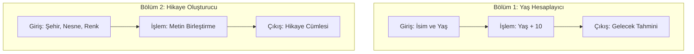
#### --- FLOAT,INT,%*/,STR --- [28.01.2026] ---
##### --- ilk bolum
```py
ekmek = float(input("ekmegin fiyati: "))
adet = int(input("adet fiyati: "))
```
##### --- ikinci bolum
```py
ekmek = float(input("ekmegin fiyati: "))
adet = int(input("adet fiyati: "))

toplam = (adet - 1) * ekmek 

print("ekmegin fiyati", ekmek, "tl", "adetin fiyati", adet, "tl", "toplam", toplam, "tl")
```
##### --- Ucuncu bolum
```py
sehir = str(input("gidicegin sehrin ismi: "))
mesafe = int(input("gidicegin uzakligi: "))
yakit = float(input("arabanin km yakacagi yakiti: "))

toplam = mesafe * yakit 

print(sehir, "sehirine gidiyorsun", mesafe, "kadar uzakliktasin", yakit, "bu kadar yakitin var", "toplam bu kadar tl harcadiniz", toplam )
```
##### --- sablon bolum
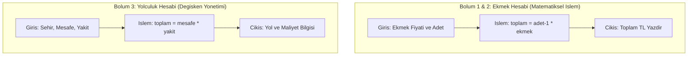
#### --- LEN,[0:2 -2:],INPUT,PRINT --- [30.01.2026] ---
##### --- Birinci bolum
```py
isim = input("ismini gir: ")
soyad = input("soyismini gir: ")
Dogum_yili = input("Dogum yilini gir: ")
ismin_boyu = len(isim)

bas_isim = isim[0:2]
bas_soyad = soyad[-2:]
bas_Dogum_yili = Dogum_yili[-2:]

kullanici_adi = "ID_" + bas_isim + bas_soyad + bas_Dogum_yili

print("ismin", isim, "soyadin", soyad, "Dogum yilin", Dogum_yili, "Kullanici ismin", kullanici_adi, "ismin boyu", ismin_boyu )
```
##### --- Ikinci bolum
```py
hayvan = input("hayvanin ismi: ")
sehir = input("sehirin ismi: ")
sayi = str(input("sansli sayi: "))


hayvan_adi = hayvan[0:2]
sehir_adi = sehir[-2:]
sayi_rakami = sayi[-2:]

kisa_takma_adi = hayvan_adi + sehir_adi + sayi_rakami 
uzunluk = len(kisa_takma_adi)

print("hayvanin ismi", hayvan, sehir, "sehirde yerlesiyor", sayi_rakami, "rakami duruyor", "takma ismi", kisa_takma_adi,)
print("HSS rakami", uzunluk)
```
##### --- sablon bolum
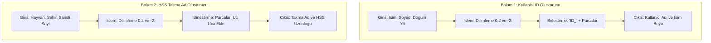
### --- II BOLUM: LISTELER --- [02.02.2026-06.02.2026]
#### --- INSERT,APPEND,REMOVE,LEN --- [02.02.2026]
##### --- ilk bolum 
```py
sehir = ["Istanbul", "Ankara", "Trabzon", "Adana", "Diyarbakir"]

print("sehirler: ", sehir)
```
##### --- ikinci bolum 
```py
sehir = ["Istanbul", "Ankara", "Trabzon", "Adana", "Diyarbakir"]

print("birinci sehir", sehir[2], "ikinci sehir", sehir[3])
```
##### --- ucuncu bolum 
```py
sehir = ["Istanbul", "Ankara", "Trabzon", "Adana", "Diyarbakir"]

sehir.insert(1, "Viyana")
sehir.append("Munih")
sehir[2] = "Askabat"

print("yeni sehirler", sehir)
```
##### --- dorduncu bolum 
```py
sehir = ["Istanbul", "Ankara", "Trabzon", "Adana", "Diyarbakir"]

sehir.insert(1, "Viyana")
sehir.append("Munih")
sehir[2] = "Askabat"
sehir.remove("Adana")
sehirler = len("sehirlerin listesi")

print("yeni sehirler", sehir, "sehirlerin sayisi", sehirler)
```
##### --- besinci bolum 
```py
sehir = ["Istanbul", "Ankara", "Trabzon", "Adana", "Diyarbakir"]

sehir.insert(1, "Viyana")
sehir.append("Munih")
sehir[2] = "Askabat"
sehir.remove("Adana")
sehirler_sayisi = len(sehir)

print("yeni sehirler", sehir)
print("sehirlerin sayisi", sehirler_sayisi)
```
##### --- altinci bolum 
```py
sehir = ["Istanbul", "Ankara", "Trabzon", "Adana", "Diyarbakir"]

sehir.insert(1, "Viyana")
sehir.append("Munih")
sehir[2] = "Askabat"
sehir.remove("Adana")
sehirler_sayisi = len(sehir)

print("yeni sehirler", sehir)
print("sehirlerin sayisi", sehirler_sayisi)
print("sondaki sehirler: ", sehir[-1], sehir[-2])

```
##### --- sablon bolum 
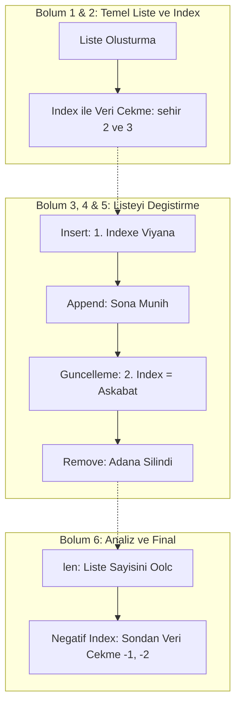
#### --- SORT,SORTED,REVERSE,(REVERSE = T) --- [04.02.2026]
##### --- ilk bolum
```py
sehirler = ["Munih", "Bayern", "Berlin", "Frankfurt"]

sehirler.reverse()

print("Sehirler siralamasi", sehirler)

sehirler.sort()

print("Sehirler siralamasi", sehirler)
```
##### --- ikinci bolum
```py
notlar = [85, 45, 100, 20, 75, 90]

notlar.sort(reverse = False)

print("bastan sona notlar", notlar)

notlar.sort(reverse = True)

print("sondan baslangica notlar", notlar)

notlar.sort()

print("True veya false kullanmadan Notlar", notlar)
```
##### --- ucuncu bolum
```py
notlar = [70, 95, 40, 60, 10]
print("Gecici not siralamasi", sorted(notlar))

notlar.sort(reverse = True)
print("sondan basina kadar notlarim", notlar)

notlar.sort(reverse = False)
print("basdan sonuna kadar notlarim", notlar)

notlar.reverse()
print("tam tersi notlarim", notlar)

notlar.append(50)
print("en bastaki siralamasiz notlarim", notlar)
```
##### --- sablon bolum
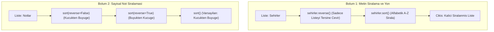
#### --- IKINCI BOLUMDEKI HEPSI --- [06.02.2026]
##### --- ilk zorlu bolum
```py
sehirler = ["Almanya", "Berlin", "Dortmund", "Munih"]

sehirler.append("Kalingrad")

print(sorted(sehirler))

sehirler.sort(reverse = True)

print(sehirler)

print(len(sehirler))
```
##### --- ikinci zorlu bolum
```py
maaslar = [3000, 4500, 5000, 2500]
yeni_eleman = int(input("Yeni elemanin maasi: "))

print("eski butun personellerin maaslari", maaslar) 

maaslar.append(yeni_eleman)

print("suanki butun personellerin maaslari", maaslar)

yuksek_maasli = max(maaslar)
dusuk_maasli = min(maaslar)

print("yuksek maasli olan", yuksek_maasli)
print(" dusuk maasli olan", dusuk_maasli)
print("Eski personellerin sıralı maaşları:", sorted(maaslar))

maaslar.pop(2)

maaslar.sort(reverse = True)

print("Su anki en guncel maas bilgileri", maaslar)
```
##### --- ucuncu zorlu bolum
```py
araclar = ["W-123", "VI-99", "S-45"]

araclar.append("E-67")
araclar.append("V-84")

print("iki yeni gelen araclarin plakasi", araclar)

araclar.insert(0, "DIPLOMAT")

print("suanki yeni gelmis diplomat plakasi ve diger araclar", araclar)

araclar.remove("VI-99")
araclar.pop(2)

print("birisi plakasi ve digeri sinir doldugu icin geri kalan araclar", araclar)

hizlar = [120, 80, 140, 110, 90]
yuksek_hiz = max(hizlar)
dusuk_hiz = min(hizlar)

print("suanki mewcut araclar", araclar)
print("en yuksek hizda giden arac", yuksek_hiz)
print("en dusuk hizda giden arac", dusuk_hiz)

print("suanki sinirin icindeki araclar", araclar)

araclar.sort(reverse = True)

print("Suanki A/Z kadar harf sistemine sinirlandirilmis araclar", araclar)
print("yasasin Arztorzka")
```
##### --- dorduncu zorlu bolum
```py
nvanter = ["M4A1", "Glock 17", "El Bombasi", "Zirh", "Kask"]
envanter.append("M24")
envanter.remove("El Bombasi")

print(sorted(envanter))
print("envantere yeni ekipman ve birsey azaldi ", envanter )

envanter.insert(0, "Gece gorus durbunu")
envanter.sort(reverse = True)

print("su anki mevcut envanter listesi", envanter)

parcaciklar = len(envanter)

print("Su anki mevcut silahlar", parcaciklar)
```
##### --- sablon zorlu bolum
```mermaid
graph TD
    subgraph "Zorlu 1: Sehir Planlama"
        A1[Liste: Sehirler] --> B1[Append: Kaliningrad]
        B1 --> C1[Sorted: Gecici Alfabetik]
        C1 --> D1[Sort Reverse: Kalici Ters Siralama]
    end

    subgraph "Zorlu 2: Maas Yonetimi"
        A2[Liste: Maaslar] --> B2[Input: Yeni Eleman]
        B2 --> C2[Max/Min: Uclari Bul]
        C2 --> D2[Pop: 2. Index Cikarildi]
        D2 --> E2[Sort Reverse: Guncel Maaslar]
    end

    subgraph "Zorlu 3: Arztorzka Gümrük"
        A3[Liste: Araclar] --> B3[Insert: DIPLOMAT Basa]
        B3 --> C3[Remove/Pop: Arac Eksiltme]
        C3 --> D3[Hiz Analizi: Max/Min Hiz]
        D3 --> E3[Sort Reverse: Plaka Siralama]
    end

    subgraph "Zorlu 4: Askeri Envanter"
        A4[Liste: Envanter] --> B4[Append/Remove: Silah Guncelleme]
        B4 --> C4[Insert: Gece Gorus Durbunu]
        C4 --> D4[Sort Reverse: Ekipman Siralama]
        D4 --> E4[Len: Parcacik Sayisi]
    end
```
### --- III BOLUM: KONTROL_AKISI VE KOSULLU_IFADELER --- [09.02.2026-14.02.2026]
#### --- IF,ELIF,ELSE,AND/OR --- [09.02.2026]
##### --- ilk karmasik bolum
```py
isim = "Dawut"
yas = 19
vize_durumu = True
askerlik_durumu = True
if yas >= 18 and vize_durumu == True:
    if askerlik_durumu == False:
        print("askerliginizi yapmadan disari cikiyorsunuz geldiginiz an askerlige gonderilyorsunuz ")
    print("yasiniz ve vize_durumu onaylandi gecebilirsiniz yasasin arztozka ")

elif yas < 18 and vize_durumu == True:
    if askerlik_durumu == False:
        print("askerligi yapmadan resit olmadan baska ulkeye gidiyorsunuz aileniz olmadan cikmaniz mumkun degil")
    print("vize durumu olsada resit degilsiniz aileniz olmadan gecemezsiniz")
else:
    if askerlik_durumu == False and yas == 18:
        print("askerlik yapmadan baska ulkeye gidemediniz bu yuzden dogru askerlik subesine yonlendiriliyorsunuz")
    print("yas veya vize durumu olumsuz gecmeniz yasak")

print("yasasin artzozka")
```
##### --- ikinci sade bolum
```py
isim = "Dawut"
yas = 18
vize_durumu = True
askerlik_durumu = True
sabika_kaydi = False
izin_kagidi = True

if sabika_kaydi == True:
    print("gecis izni sabika kaydiniz oldugu icin reddedildi")

elif yas >= 18 and vize_durumu and askerlik_durumu and izin_kagidi:
    print(f"Hos geldin {isim} Butun prosudur uyuyor devam edebilirsiniz")

elif izin_kagidi == True:
    print("belgeleriniz eksik olsada izin kagidi oldugu icin gecebilirsiniz")

elif yas < 18 or vize_durumu == False:
    print("uzgunuz ama yasiniz veya vize durumu uygun degil giris reddedildi")

else:
    print("prosudurlerin cogunu karsilamadiginiz icin vize reddedildi")
```
##### --- ucuncu bolum
```py
isim = "Epstein"
yas = 18
para = 500
yaninda_arkadasin_varmi = True
vip_cart = False

if vip_cart == True:
    print(f"Hos geldiniz {isim} iceri girebilirsiniz")

elif vip_cart == False and yas >= 18 and (para >= 1000 or yaninda_arkadasin_varmi == True):
    print(f"iceri girebilirsiniz {isim}")

else:
    print("uzgunum iceri giremezsiniz")

iste gemini 
```
##### --- dorduncu bolum
```py
isim = "Epstein"
yas = 18
para = 500
yaninda_arkadasin_varmi = True
vip_cart = False

if vip_cart == True:
    print(f"Hos geldiniz {isim} iceri girebilirsiniz")

elif vip_cart == False and yas >= 18 and (para >= 1000 or yaninda_arkadasin_varmi == True):
    print(f"iceri girebilirsiniz {isim}")

else:
    print("uzgunum iceri giremezsiniz")

```
##### --- besinci bolum
```py
isim = "Dawut"
kart_var_mi = False
sifre_dogru_mu = False
parmak_izi_onayli_mi = False
yuz_tanima_onayli_mi = False
acil_durum_modu = False

if acil_durum_modu == True:
    print("UYARI KAPILAR KILITLENDI")

elif kart_var_mi and parmak_izi_onayli_mi:
    print(f"vip oldugunuc icin geciz izni verildi {isim} yasasin artzortkza")

elif kart_var_mi == False and sifre_dogru_mu == False and(parmak_izi_onayli_mi == True or yuz_tanima_onayli_mi == True ):
    print("giris onaylandi")

else:
    print("YETKISIZ GIRIS GUVENLIK CAGRILIYOR")
```
##### --- altinci bolum
```py
isim = "David Agnus"
vize = True
almanca_puan = 100
banka_bakiyesi = 9000
alman_pasaport = True

if alman_pasaport:
    print(f"GUTEN MORGEN {isim} lutfen devam edin Heil GERMANICH")

elif vize:
    if almanca_puan >= 70 and banka_bakiyesi >= 7000:
        print("vize diliniz ve banka seviyeniz iyi gecebilirsiniz")
    else:
        print("vizeniz var ama digerlerde sinifta kaldiniz vizeniz kismen reddedildi")
else:
    print("istekleri karsilamiyorsunuz reddedildi")

```
##### --- yedinci bolum
```py
kat_numarasi = 21
yetki_seviyesi = 2
yangin_alarmi = False

if yangin_alarmi == True:
    print("GECERSIZ BINA TAHLIYE EDILIYOR")

elif kat_numarasi >= 21 or kat_numarasi <= 40:
    if yetki_seviyesi >= 2:
        print(f"suan sizde {yetki_seviyesi} yetki karti bulunuyor suan {kat_numarasi} kat seviyesi cikiyor ")
    else:
        print("uzgunum bu kata cikalamaz yetki seviyeniz dusuk")
elif kat_numarasi <= 20:
    if yetki_seviyesi <= 1:
        print(f" 1 yetki karti bulunuyor suan 20 kata kadar erisim var {kat_numarasi} kata cikiliyor")
```
##### --- birinci sablon bolum
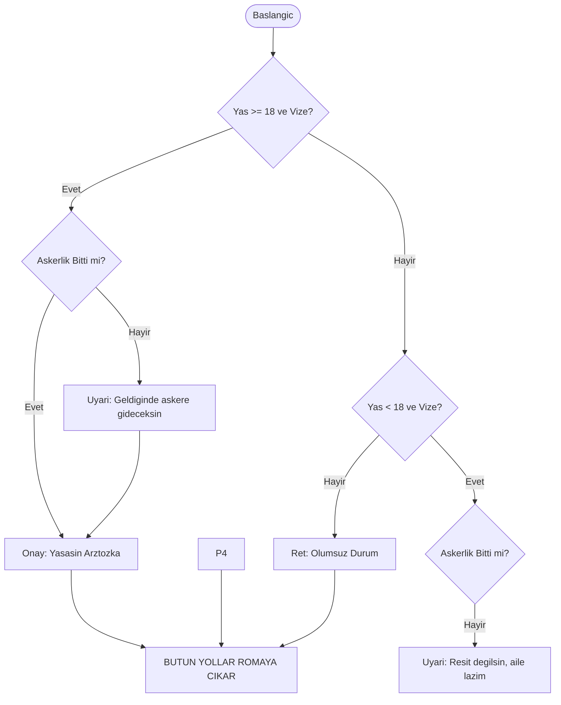
##### --- ikinci sablon bolum
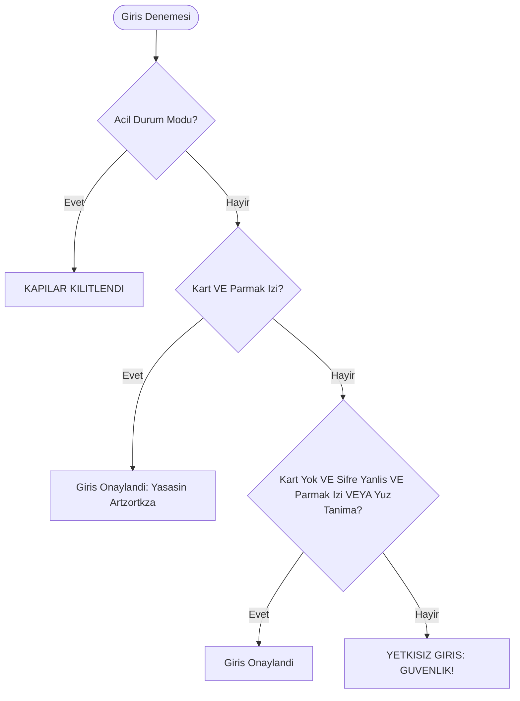
##### --- ucuncu sablon bolum
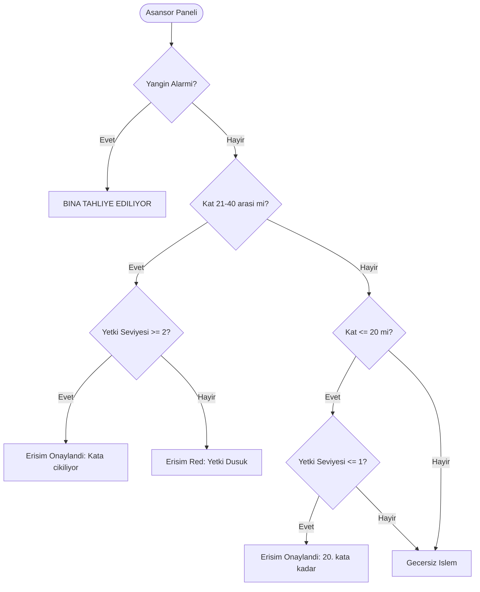
#### --- carsamba gunu dinlenme gunu oldu [11.02.2026]
#### --- UCUNCU BOLUMDEKI HEPSI --- [13.02.2026]
##### --- birinci bolum
```py
sinava_girdi = True
notu = 50

if sinava_girdi == True:
    print("sinava girdin tamam")
    if notu >= 50:
        print("sinavi gectin tebrikler")
    else:
        print("sinavi gecemedin seneye tekrar dene")
else:
    print("sinava girmemissin bir dahaki sefere")
```
##### --- ikinci bolum 
```py
kart_takili = True
if kart_takili == True:
    print("kart suan takili islem yapiliyor")
    sifre = int(input("sifrenizi girin: "))
    if sifre == 1234:
        print("sifre dogru kartinizi alabilirsiniz")
    else:
        print("PIN yanlis")
else:
    print("kartiniz yoksa islem yapilamaz")
```
##### --- ucuncu bolum 
```py
yas = 18
Los_polloz_hermanos = False

if Los_polloz_hermanos == True:
    print("iceri girin")
elif yas >= 18:
    print("yasiniz buyuk tamam")
    bilet_varmi = str(input("Bilet varmi?: "))
    if bilet_varmi == "evet":
        print("tamam iceri girebilirsiniz iyi eglecenler")
    else:
        para_varmi = int(input("paraniz varmi peki?: "))
        if para_varmi >= 200:
            print("tamam iceri girebilirsiniz sorun cikarmtmayin")
        else:
            print("uzgunum para olmadan giremezsiniz")
else:
    print("uzgunum yasiniz buna uygun degil") 
```
##### --- dorduncu bolum
```py
almanca = input("Almanca biliyormusunuz: ")
diploma = input("universite mezunumuzsunuz: ")
if almanca == "evet" and diploma == "evet":
    print("tamam o zaman ek detatylara basliyalim")
    maas = int(input("yillik kac euro maas aliyorsunuz ?"))
    if maas >= 50000:
        print("tebrikler! Blue kart onayli")
    elif maas >= 40000 and maas <= 50000:
        print("blue kart icin ek inceleme yapilmali")
    else:
            print("maasiniz yetersiz bu yuzden calisma vizesi ile gidiyorsunuz")
else:
    print("uzgunum almancaniz veya unicersite diplomaniz yok bu yuzden gecemezsini")
```
##### --- ilk sablon bolum
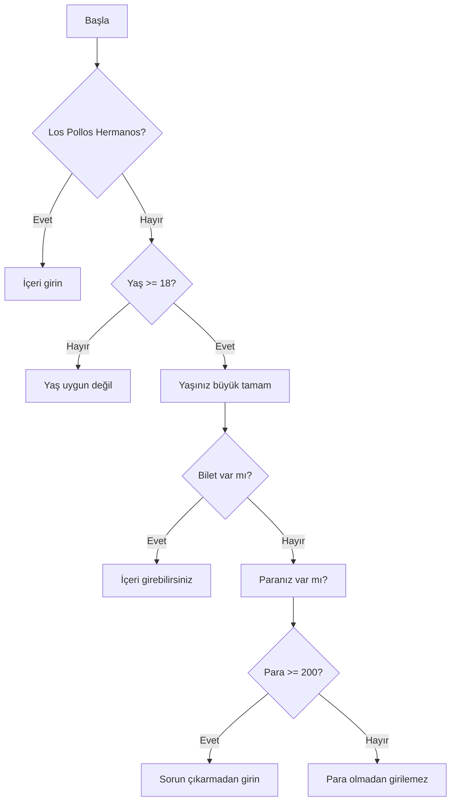
##### --- ikinci sablon bolum
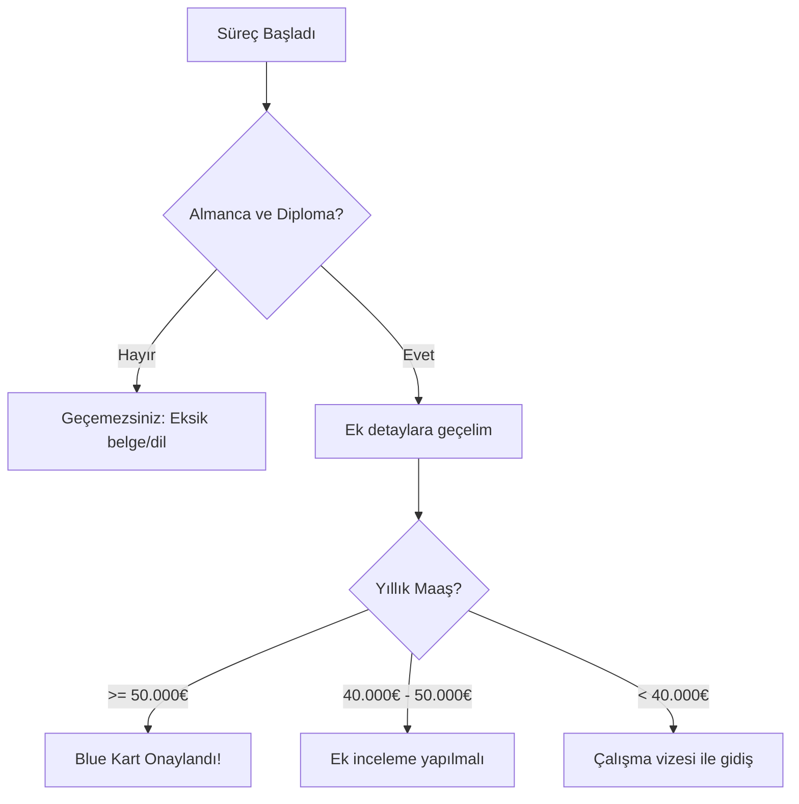
#### --- CARSAMBA GUNU TELAFI IF,ELIF,ELSE,NESTED IF --- [14.02.2026]
##### --- ilk bolum
```py
butce = 12000
sponsor_var_mi = False
dil_seviyesi = "B2"

if butce >= 12000 or sponsor_var_mi == True:
    print("butce/sponsor bulunmakta devam edelim")
    if dil_seviyesi == "B1" or dil_seviyesi == "B2":
        print("dil seviyeniz uygun vize alabilirsinz")
    else:
        print("uzgunum dil gecerliliginiz B1 den dusuk alamam")
else:
    print("uzgunum butce rakami dusuk veya sponsorlugunuz yok giris reddedildi ") 
```
##### --- ikinci bolum 
```py
yas = 18
sabika_kaydi = True
tecrube_yili = 2
ustun_yetenek = True

if yas == 18:
    print("yasiniz 18 veya 18 den yukarida vizeye devam edelim ")
    if sabika_kaydi == False and (tecrube_yili >= 2 or ustun_yetenek):
        print("sabika kaydiniz yok ve tecrube_yili/ustun_yetenigiz oldugu belli vize kabul edildi")
    else:
        if sabika_kaydi == True:
            print("uzgunum sabika kaydiniz var vize reddedildi")
        elif tecrube_yili < 2 or ustun_yetenek == False:
            print("uzgunum tecrube_yiliniz/ustun_yeteginiz yok bu yuzden vize reddedildi")
else:
    print("18 yasdan kucuksunuz vize reddedildi")
```
##### --- ucuncu bolum
```py
yas = 18
sabika_kaydi = True
tecrube_yili = 2
ustun_yetenek = True

if yas == 18:
    print("yasiniz 18 veya 18 den yukarida vizeye devam edelim ")
    if sabika_kaydi == False and (tecrube_yili >= 2 or ustun_yetenek):
        print("sabika kaydiniz yok ve tecrube_yili/ustun_yetenigiz oldugu belli vize kabul edildi")
    else:
        if sabika_kaydi == True:
            print("uzgunum sabika kaydiniz var vize reddedildi")
        elif tecrube_yili < 2 or ustun_yetenek == False:
            print("uzgunum tecrube_yiliniz/ustun_yeteginiz yok bu yuzden vize reddedildi")
else:
    print("18 yasdan kucuksunuz vize reddedildi")
```
##### --- dorduncu bolum karmasik
```py
GPA = 2.9
IELTS = 6.4
disiplin_cezasi = True

if disiplin_cezasi == False:
    print("disiplin cezasi yok diger onemli kurallara devam edelim")
    if GPA >= 4.0 and IELTS >= 6.5:
        print("GPA ve IELTS ortalamasi karsiliyor universiteye kabul edildiniz")
    elif GPA >= 5.0 and IELTS < 6.5:
        print("GPA Durumu yeterli ama IELTS yetersiz universitede iyice hazirlanmalisinz istisna olarak GPA normalden yuksek universite kabul edildiniz")
    elif GPA < 3.0 and IELTS >= 6.5:
        print("IELTS yuksek olsada GPA dusuk bu yuzden bir dahaki sefere universite kabul edilmedi")
    elif GPA < 3.0 and IELTS < 6.5:
        print("uzgunum GPA ve IELTS yetersiz bu yuzden universite bolumu kabul edilmedi")
    else:
        print("Akademik sartlar tam saglanamadi")
else:
    print("disiplin cezasi yuzunden reddedildi")
```
##### --- dorduncu bolum sade
```py
GPA = 3.0
IELTS = 6.5
disiplin_cezasi = True

if disiplin_cezasi:
    print("disiplin cezasi kabul edilmesi")
else:

    normal_kabul = (GPA >= 3.0 and IELTS >= 6.5)
    istisna_kabul = (GPA >= 4.0 and IELTS >= 6.0)

    if normal_kabul or istisna_kabul:
        print("universiteye hos geldiniz")
    else:
        print("Sartlar saglanamadi")
```
##### --- ilk sablon bolum
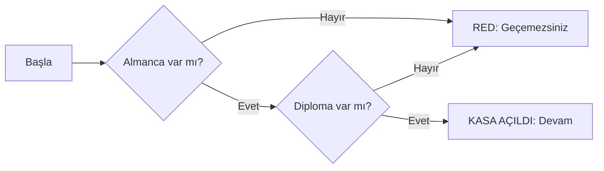
##### --- ikinci sablon bolum
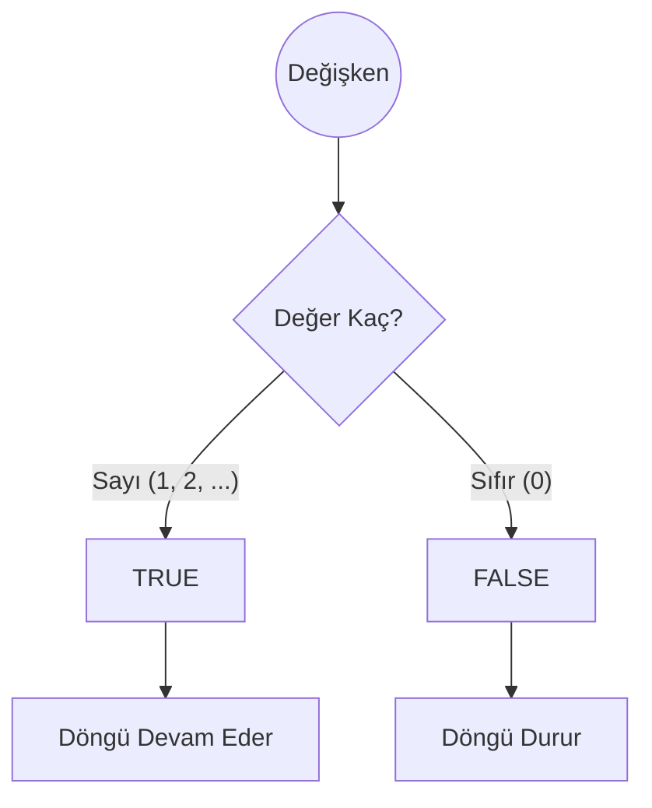
### --- IV BOLUM: DONGULER --- [16.02.2026-21.02.2026] 
#### --- FOR IN RANGE --- [16.02.2026_and_17.02.2026]
##### --- ilk bolum 
```py
#while dongusu
sayi = 10
while sayi >= 0:
    print(f"sayi: {sayi}")
    sayi = sayi - 1
print("bitdi")

# for dongusu
listeler = ["karpuz", "elma", "cilek", "ananas"]
for liste in listeler:
    print(f"meyveler: {liste}")

if liste == "cilek":
        print(f"meyveler: {liste} - Bu benim en sevdiğim!")
    else:
        print(f"meyveler: {liste}")
```
##### --- ikinci bolum
```py
#for dongusu
sayilar = [5, 12, 8, 20, 3, 15, 30]

for sayi in sayilar:
    if sayi > 10:
        print(f"buyuk sayi {sayi}")
    else:
        print(f"kucuk sayi {sayi}")

#while dongusu
while True:
    komut = input("donguyu kapatmak istiyorsaniz 'kapat' diyin: ")

    if komut == 'kapat':
        break

print("dongu kapatildi")
```
##### --- ucuncu bolum
```py
# for birincisi
sayi = 0

for sayi in range(0, 21, 2):
    print(f"{sayi} cift sayilar")

#for ikincisi

uyeler = ["Dawut", "Gus", "Jesse", "Walter", "Skyler"]
kisi = "Walter"
for kisi in uyeler:
    if kisi == "Walter":
        print("walter iceri girmeye calisiyor engelleyin")
    else:
        print(f"hos geldiniz {kisi} iceri girin")

#for ucuncusu

toplam = 20

for gun in range(1, 5):
    toplam = toplam + 5
    print(f"{gun} gun sonra ve 5 lira yatirildiginda para {toplam} ")

print(f"{gun} sonunda mevcut para {toplam}")
```
##### --- sablon ilk bolum
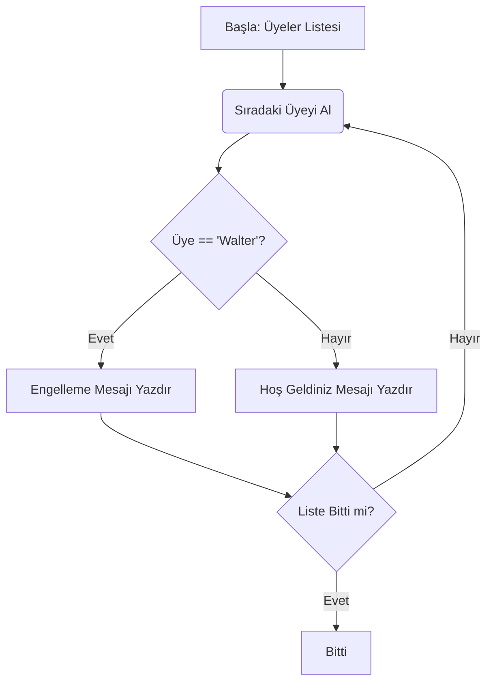
##### --- sablon ikinci bolum
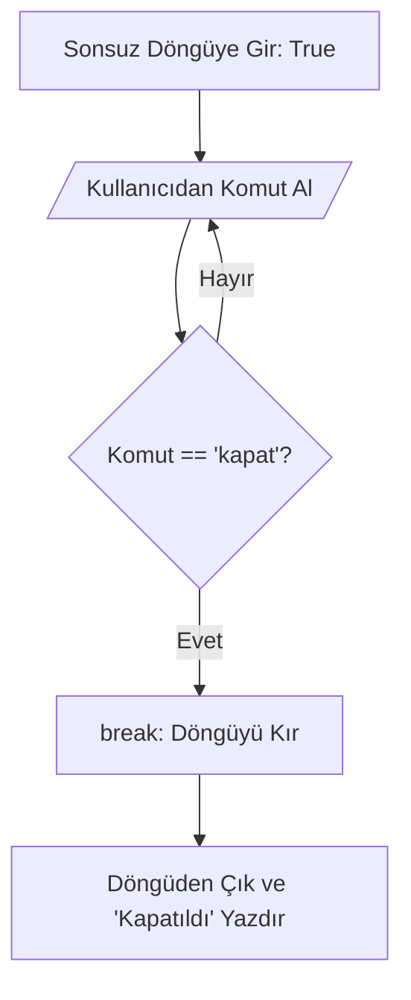
#### --- FOR CONTINUE BREAK --- [18.02.2026_and_19.02.2026]
##### --- ilk bolum
```py
for sayi in range(1, 16):
    if sayi != 7:
        print(f"sayi: {sayi}")
        continue
```
##### --- ikinci bolum
```py
stoklar = [15, 20, 5, 0, 10, 30]

for stok in stoklar:
    if stok == 0:
        break
    print(f"stoklardaki mevcut sayi {stok}")
```
##### --- ucuncu bolum
```py
veriler = [100, 200, "HATA", 300, "VIRUS", 400, 500]

for veri in veriler:
    if veri == "HATA":
        continue
    if veri == "VIRUS":
        break

    print(f"veriler isleniyor {veri}")
```
##### --- dorduncu bolum
```py
kuyruk_q = ["Sivil_1", "HATA", "Diplomat", "KACAKCI", "Sivil_2", "Sivil_3", "Sivil_4", "BOMBACI", "Sivil_5"]
for kuyruk_a in kuyruk_q:
    
    if kuyruk_a == "HATA":
        continue
    
    if kuyruk_a == "Diplomat":
        print(f"ust yetkili bolgesne gonderiliyorsunuz! {kuyruk_a} bey")

    if kuyruk_a == "KACAKCI":
        print(f"Giris reddedildi suphel sahis {kuyruk_a}")
        continue

    if kuyruk_a == "BOMBACI":
        print("GUVENLIK AYARI SISTEM KAPATILDI")
        break

    print(f"kuyruktaki sahis {kuyruk_a}")
```
##### --- ilk sablon bolum
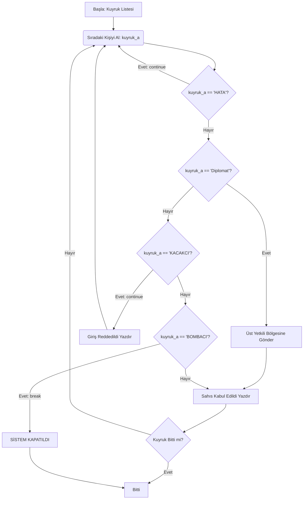
#### --- BREAK FOR RANGE --- [20.02.2026_and_21.02.2026]
##### --- ilk bolum
```py
 Bina_A = ["Kat_1", "Kat_2"]

for Bina_B in Bina_A:
    print(f"suanki bina {Bina_B}")

    for Bina_C in range(1, 4):
        print(f"{Bina_B} - {Bina_C}")
```
##### --- ikinci bolum
```py
gunler = ["Pazartesi", "Sali"]
saatler = ["Sabah", "Aksam"]
for gun in gunler:
    for saat in saatler:
        if gun == "Sali" and saat == "Aksam":
            print(f"{gun} ve {saat} dolasiyla vardiya bitdi sinir kapisi kapatildi")
        else:
            print(f"{gun} ve {saat} kaydi yapildi")
```
##### --- ucuncu bolum
```py
bulundu = False

for x in range(4):
        print(f"Koordinat: ({x}, {y})")
        
        if x == 2 and y == 2: 
            print(f"--- HEDEF BULUNDU ({x},{y}) ---")
            bulundu = True
            break
            
    if bulundu:
        print("Sistem tamamen kapatiliyor...")
        break
```
##### --- dorduncu bolum
```py

Crazy_8_bulundu = False

for evler in range(1, 4):
    for odalar in range(1, 3):
        print(f"ev ve odalar kontrol ediliyor ({evler}, {odalar})")

        if evler == 2 and odalar == 1:
            print(f"HIRSIZ BULUNDU ! ({evler}, {odalar}) Bolgede Yakalandi")
            Crazy_8_bulundu = True
            break
    if Crazy_8_bulundu == True:
        print("Operasyon Sonlaniyor")
        break
```
##### --- besinci bolum 
```py
dogru_sifre = "2025"
girilen_sifre = ""


while girilen_sifre != dogru_sifre:
    girilen_sifre = input("Sifreyi girin: ")
    
    if girilen_sifre != dogru_sifre:
        print("Sifre tekrar yazin")
    else:
        print("Sifre dogru sistem tamamen acildi")
    
sistem_aktif = True
kamyonlar = ["Kamyon_1", "Kamyon_2", "Kamyon_3"]
icerik = ["Normal", "KACAKCI", "Normal", "BOMBACI", "Normal"]

for kamyon in kamyonlar:
    if not sistem_aktif:
        break
    for koli in icerik:
        print(f"{kamyon} ve koli {koli} taraniyor...")
        if koli == "KACAKCI":
            print(F"DIKKAT: {kamyon} daki koli {koli} bulundu denetim aranma yapiliyor")
        elif koli == "BOMBACI":
            print("UYARI SISTEM KAPANIYOR !")
            sistem_aktif = False
            break
```
##### --- ilk sablon bolum
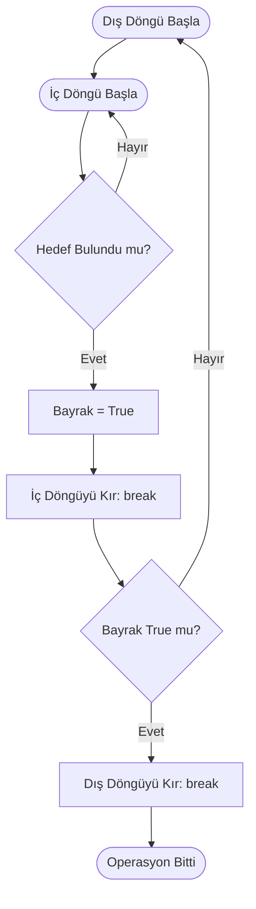
### --- V BOLUM: SOZLUKLER --- [23.02.2026-27.02.2026]
#### --- KEY {} VALUE [] --- [23.01.2026]
##### --- ilk bolum
```py
yolcu = {
    "ad": "Dawut",
    "soyad": "Gociyew",
    "pasaport_no": "123456",
    "yas": "16"
}

print(yolcu["ad"])
print(yolcu["pasaport_no"])
```
###### --- ilk bolum gelistirilmis hali 
```py
yolcu = {
    "ad": "Dawut",
    "soyad": "Gociyew",
    "pasaport_no": "123456",
    "yas": "16"
}

print(f"Yolcu adi: {yolcu['ad']} | pasaport {yolcu['pasaport_no']}")
```
##### --- ikinci bolum
```py
yolcu = {
    "ad": "Dawut",
    "soyad": "Gociyew",
    "pasaport_no": "123456",
    "yas": "16"
}

print(f"Yolcu adi: {yolcu['ad']} | pasaport {yolcu['pasaport_no']}")
print(f"Yolcunun eski yasi {yolcu['yas']}")
yolcu["yas"] = 19

yolcu["ulke"] = "Turkmenistan"

print(f"yolcunun yeni yasi {yolcu['yas']}  | suanki yasadigi ulke {yolcu['ulke']} ")
```
##### --- ucuncu bolum
```py
yolcu_kart = {
    "ad": "Walter",
    "bagaj_kg": 20,
    "vize": False,
}

print(f"yolcunun ismi {yolcu_kart['ad']} ve bagaj kg {yolcu_kart['bagaj_kg']}")

yolcu_kart["bagaj_kg"] += 5

yolcu_kart["kontrol_noktasi"] = "Terminal-A"


print(f"Yolcunun guncel adi {yolcu_kart['ad']} bagacin agrami {yolcu_kart['bagaj_kg']} ve bulundugu terminal {yolcu_kart['kontrol_noktasi']}") 

yolcu_kart ["yeni_kisi"] = "Pinkman"

yolcu_kart ["kamera_sistemi"] = "Terminal-A_1294"
print(f"{yolcu_kart['ad']} yanindaki sahis {yolcu_kart['yeni_kisi']} terminalin yanindaki {yolcu_kart['kamera_sistemi']} yanindaki kameradan kayitlara karismistir ")
```
##### --- dorduncu bolum
```py
yolcu_kart = {
    "ad": "Walter",
    "bagaj_kg": 20,
    "vize": False,
}

print(f"yolcunun ismi {yolcu_kart['ad']} ve bagaj kg {yolcu_kart['bagaj_kg']}")

yolcu_kart["bagaj_kg"] += 5

yolcu_kart["kontrol_noktasi"] = "Terminal-A"


print(f"Yolcunun guncel adi {yolcu_kart['ad']} bagacin agrami {yolcu_kart['bagaj_kg']} ve bulundugu terminal {yolcu_kart['kontrol_noktasi']}") 

yolcu_kart["yeni_kisi"] = "Pinkman"

yolcu_kart["kamera_sistemi"] = "Terminal-A_1294"
print(f"{yolcu_kart['ad']} yanindaki sahis {yolcu_kart['yeni_kisi']} terminalin yanindaki {yolcu_kart['kamera_sistemi']} yanindaki kameradan kayitlara karismistir ")

yolcu_kart["???"] = "___"

print(f"Walter ve yanindaki sahis pinkmandan sonra {yolcu_kart['???']}k gecmistir kendisi Walter bacanagi oldugu dusunulmekte kamera kaydi {yolcu_kart['kamera_sistemi']} kayiplara karisilmistir")
```
##### --- ilk sablon bolum
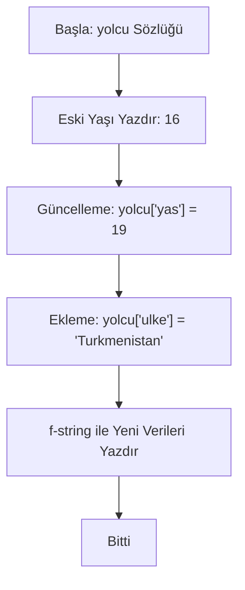
##### --- ikinci sablon bolum
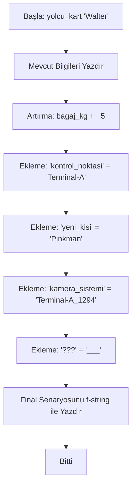
#### --- POP() GET() DEL() --- [25.01.2026]
##### --- ilk bolum
```py
iste gemini

envanter = {
    "Urun": "Mavi kristal",
    "Miktar": "50 Gram",
    "lokasyon": "Karavan",
}

print("--- BILGILER GUNCELLENIYOR ---")

for deger, miktar in envanter.items():
    print(f"bilgiler araniyor {deger}  {miktar}")
print("UYARI HANK KAYITLARA BAKMAYA CALISIYOR")
envanter["Miktar"] = "100 Gram"
print("")
if "lokasyon" in envanter:

    del envanter["lokasyon"]

print("\n [UYARI] KAYITLAR SILINIYOR")

print(f"suan {envanter['Urun']} var ve miktar olarak {envanter['Miktar']} kadar gram var ")

print("Hank durumu anlamadi ama birakmayacak kotu tarafi mike jessie ariyor")
```
##### --- ikinci bolum
```py
yolcu = {
    "isim": "Saul",
    "vize": "Var",
}

yas_bilgisi = yolcu.get("Yas", "Bilgisi kayitli degil")
print(f"Kullnanici yas bilgisi {yas_bilgisi}")

if "vize" in yolcu:
    silinen_sey = yolcu.pop("vize")
    print("uzgunuz ama vizeniz iptal edildi")

print(f"bay {yolcu['isim']} suan vizeniz iptal edildi geri donmek zorundasiniz")
```
##### --- ilk sablon bolum
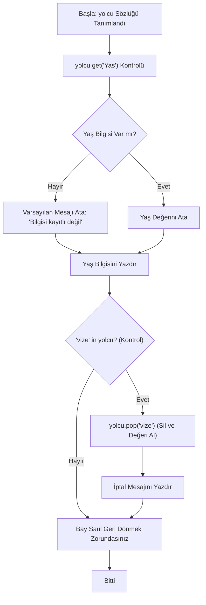
#### --- UPDATE() CLEAR() --- [27.01.2026]
##### --- ilk bolum
```py
jessi_evi = {
    "evdeki_konak": "Walter",
    "mavi_stok": 500,
}

yeni_bilgiler = {
    "evin_sahibi": "Jessi",
    "lokasyon": "Colbuquerque",
    "durum": "Gizli"
}

jessi_evi.update(yeni_bilgiler)

jessi_evi["evdeki_konak"] = "Asci"
guvenlik_seviyesi = jessi_evi.get("guvenlik", "Güvenlik seviyesi atanmamiş")
print(f"gecici olarak {guvenlik_seviyesi}")
if "lokasyon" in jessi_evi:
    silinen_lokasyon = jessi_evi.pop("lokasyon")
    print(f"{silinen_lokasyon} lokasyon silindi nerede oldugu bilinmiyor")

print(f"guvenlik durum suan {yeni_bilgiler['durum']} hadi {jessi_evi['evdeki_konak']} biraz met yapalim")

jessi_evi["evdeki_konak"] = "Walter White"
yeni_bilgiler["evin_sahibi"] = "Jessie Pinkman"

print(f" mike elindeki kayitli bilgiler {jessi_evi}")
```
##### --- ikinci bolum
```py
jessi_evi = {
    "evdeki_konak": "Walter",
    "mavi_stok": 500,
}

yeni_bilgiler = {
    "evin_sahibi": "Jessi",
    "lokasyon": "Colbuquerque",
    "durum": "Gizli"
}

jessi_evi.update(yeni_bilgiler)

jessi_evi["evdeki_konak"] = "Asci"
guvenlik_seviyesi = jessi_evi.get("guvenlik", "Güvenlik seviyesi atanmamiş")
print(f"gecici olarak {guvenlik_seviyesi}")
if "lokasyon" in jessi_evi:
    silinen_lokasyon = jessi_evi.pop("lokasyon")
    print(f"{silinen_lokasyon} lokasyon silindi nerede oldugu bilinmiyor")

print(f"guvenlik durum suan {yeni_bilgiler['durum']} hadi {jessi_evi['evdeki_konak']} biraz met yapalim")

jessi_evi["evdeki_konak"] = "Walter White"
yeni_bilgiler["evin_sahibi"] = "Jessie Pinkman"

print(f" mike elindeki kayitli bilgiler {jessi_evi}")

jessi_evi.clear()
print(f"Mike kanitlari yok etdi: {jessi_evi}")
print(f"dis bilgi hala duruyormu: {yeni_bilgiler}")
```
##### --- ilk sablon bolum
```mermaid
graph TD
    Start([Başla]) --> Define[Sözlükler Tanımlandı: jessi_evi ve yeni_bilgiler]
    Define --> Update["jessi_evi.update(yeni_bilgiler)"]
    Update --> Change["evdeki_konak = 'Asci'"]
    Change --> Get["guvenlik_seviyesi = .get('guvenlik')"]
    Get --> Check{lokasyon anahtarı var mı?}
    Check -- Evet --> Pop["silinen_lokasyon = .pop('lokasyon')"]
    Check -- Hayır --> Print[Bilgileri Yazdır]
    Pop --> Print
    Print --> FinalUpdate["Veriler Son Kez Güncellendi"]
    FinalUpdate --> Clear["jessi_evi.clear()"]
    Clear --> End([Bitti: Kanıtlar Yok Edildi])
```