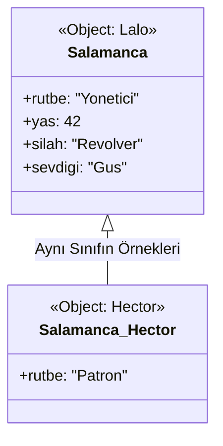

# --- ZWEITE PERIODE PYTHON OFFLINE HANDBUCH 
## --- PYTHON BASLAYIP BITIRME IKINCI KISIM 
```PY
Hafta,Konu,"Gemini'nin ""Profesyonel"" Dokunuşu"
1-2. Hafta,"Sınıf, Nesne, __init__, self","Kritik: Bu iki haftayı birbirinden ayırma, iç içe işle. Çünkü __init__ olmadan bir sınıf ""ruhsuz bir heykel"" gibidir. İlk hafta hem kalıbı yapalım hem de içine veriyi (şekeri, tuzu) koyalım."
4-5. Hafta,Miras (Inheritance),"Ekleme: Burada ""Kod Tekrarı"" (Don't Repeat Yourself - DRY) ilkesini kafamıza kazıyacağız. Walter White'ın her seferinde sıfırdan laboratuvar kurmadığını, var olanı kullandığını düşün."
9. Hafta,Hata Yönetimi,"Düzenleme: Bunu 8. haftaya çekebiliriz. Çünkü dosya işlemlerine (10. Hafta) geçtiğimizde ""Dosya bulunamadı"" gibi hataları yönetmeyi önceden bilmelisin."
10. Hafta,Dosya İşlemleri & Final,"Zirve: Burada sadece dosya okumayacağız. Tüm Salamanca ailesini bir .json veya .txt dosyasına ""kaydedip"" programı kapatıp açtığımızda geri getireceğiz."
```

## --- HATA TURLERI VE DUZELTME 
### --- [ATTRIBUTE_ERROR] --- [B_1.0-B_1.4]
```PY
B_1.0 Nesne Yönelimli Programlama: Nesne ve Özellik İlişkisi
Sınıfları (Class) birer kalıp, nesneleri (Object) ise bu kalıptan çıkan somut varlıklar olarak tanımlamıştık. Bir nesne üzerinden, o sınıfın içinde tanımlanmamış bir şeye ulaşmaya çalışırsan Python "Ben bunu tanımıyorum" der.

B_1.1 Hata Tanımı: AttributeError Nedir?
AttributeError, bir nesnenin sahip olmadığı bir özelliğe (attribute) veya metoda (fonksiyon) erişmeye çalıştığında ortaya çıkar. Yani, mimari planda (Class) olmayan bir odayı, inşa edilmiş evde (Object) aramaya benzer.

B_1.2 Uygulamalı Hata Örneği (Hata Alalım)
Senin verdiğin hukuk bürosu örneği üzerinden gidelim. Bir müvekkil oluşturacağız ama planda olmayan bir bilgiyi isteyeceğiz:
# 1. Kalıbımızı tanımlıyoruz
class Muvekkil:
    buro = "Saul Goodman & Associates"
    sehir = "Albuquerque"

# 2. Nesnemizi üretiyoruz
yeni_muvekkil = Muvekkil()

# 3. HATA ALACAĞIMIZ SATIR:
# Sınıf içinde 'suc' diye bir değişken tanımlamadık.
print(yeni_muvekkil.suc)
Alacağın Hata Mesajı:
AttributeError: 'Muvekkil' object has no attribute 'suc'

B_1.3 Hata Analizi ve Çözümü
Bu hatayı aldığında izlemen gereken disiplinli yol şudur:

Yazım Denetimi: Özelliğin adını doğru yazdın mı? (Örn: sehir yerine shir mi yazdın?)

Tanım Kontrolü: Erişmek istediğin değişken class bloğunun içinde tanımlanmış mı?

Kapsam Kontrolü: Değişken sadece belirli bir fonksiyonun içinde mi yoksa sınıfın genelinde mi?

Çözüm: Eğer bir veriye ulaşmak istiyorsan, onu mutlaka sınıfın içinde belirtmelisin:
class Muvekkil:
    buro = "Saul Goodman & Associates"
    sehir = "Albuquerque"
    suc = "Vergi Kaçırma" # Artık bu özellik mevcut.

yeni_muvekkil = Muvekkil()
print(f"Müvekkil Suçu: {yeni_muvekkil.suc}") # Hata çözüldü.

B_1.4 Pratik Kural: hasattr() Kontrolü
İleride karmaşık projeler yaparken, bir nesnenin o özelliğe sahip olup olmadığından emin değilsen programın çökmemesi için şu yöntemi kullanabilirsin:
if hasattr(yeni_muvekkil, "dosya_no"):
    print(yeni_muvekkil.dosya_no)
else:
    print("Hata: Bu müvekkilin henüz bir dosya numarası yok!")
```
### --- [SYNTAX_ERROR] --- [B_2.0-B_2.4]
```PY
B_2.0 Nesne Yönelimli Programlama: Yazım Kuralları ve SyntaxError
Python'da her şeyin bir kuralı vardır. Sınıf tanımlarken bu kurallardan birini bile atlarsan, Python kodu hiç çalıştırmaz ve kapıyı yüzüne kapatır. Buna SyntaxError (Sözdizimi Hatası) diyoruz.

B_2.1 Hata Tanımı: SyntaxError Nedir?
SyntaxError, Python'un dil bilgisi kurallarına uymadığında ortaya çıkar. Bir cümlede noktalamayı unutmak veya parantezi kapatmamak gibidir. Python bu hatayı gördüğü an "Ben bu cümleyi anlamadım, o yüzden işleme devam edemem" der.

B_2.2 Uygulamalı Hata Örneği (Hata Alalım)
Sınıf tanımlarken en sık yapılan üç SyntaxError örneğini tek bir yapı üzerinde görelim:
# HATA 1: İki nokta (:) unutulursa
class Muvekkil  # Buraya iki nokta gelmeliydi
    buro = "Saul Goodman & Associates"

# HATA 2: Parantez dengesizliği veya yanlış kullanımı
yeni_muvekkil = Muvekkil( # Parantez kapatılmadı

# HATA 3: Geçersiz isim kullanımı
class 1NumaraliMuvekkil: # Sınıf isimleri sayı ile başlayamaz
    pass
Alacağın Hata Mesajı:
SyntaxError: invalid syntax veya SyntaxError: unexpected EOF while parsing

B_2.3 Hata Analizi ve Disiplinli Çözüm
Sınıf yapılarında SyntaxError aldığında şu kontrol listesini (checklist) uygula:

İki Nokta (:) Kontrolü: class isminden sonra : koydun mu?

Blok Girintisi (Indentation): Sınıfın içindeki özellikler (buro, sehir vb.) bir tab içeride mi? (Bu bazen IndentationError verse de geniş anlamda sözdizimi ile ilgilidir).

İsimlendirme: Sınıf adın bir sayı ile mi başlıyor yoksa arada boşluk mu var? (Örn: class Yeni Muvekkil hatadır, class YeniMuvekkil doğrudur).

Doğru Yazım:
class Muvekkil: # Kural 1: İki nokta tam.
    # Kural 2: Girinti (4 boşluk/1 tab) içerde.
    buro = "Saul Goodman & Associates"

yeni_muvekkil = Muvekkil() # Kural 3: Parantez kapatıldı.
B_2.4 Pratik Bilgi: SyntaxError Neden Diğerlerinden Farklıdır?
AttributeError veya TypeError aldığında programın bir kısmı çalışabilir ve hata satırına gelince durur. Ancak SyntaxError varsa, Python kodu daha en baştan reddeder. Yani motoru hiç çalıştıramazsın.

```
### --- [TYPE_ERROR] ---[B_3.0-B_3.4]
```PY
B_3.0 Nesne Yönelimli Programlama: Metotlar ve TypeError
Bir sınıfa sadece özellik (isim, şehir) değil, yetenek (fonksiyon) eklediğimizde bu fonksiyonlara Metot diyoruz. Python'da metotların çok katı bir kuralı vardır: self.

B_3.1 Hata Tanımı: TypeError (self Unutulursa) Nedir?
TypeError, bir fonksiyonun beklediğinden fazla veya az argüman alması durumunda ortaya çıkar. Sınıf içindeki bir metodu çağırdığında Python, arka planda nesnenin kendisini (self) otomatik olarak o metoda gönderir. Eğer sen metodun parantez içine self yazmazsan, Python "Ben sana bir şey gönderdim ama sen kabul etmedin" diyerek hata verir.

B_3.2 Uygulamalı Hata Örneği (Hata Alalım)
Saul Goodman'ın meşhur repliğini söyleyen bir metot ekleyelim ama self parametresini bilerek unutalım:
class Muvekkil:
    buro = "Saul Goodman & Associates"

    # HATA: Parantez içine 'self' yazmadık!
    def slogan_soyle():
        print("Better Call Saul!")

yeni_muvekkil = Muvekkil()

# Metodu çağırıyoruz
yeni_muvekkil.slogan_soyle()

Alacağın Hata Mesajı:
TypeError: slogan_soyle() takes 0 positional arguments but 1 was given
    Analiz: Sen parantezi boş bıraktın (0 arguments), ama Python otomatik olarak nesneyi içeri gönderdi (1 was given).

B_3.3 Hata Analizi ve Disiplinli Çözüm
Bu hata ile karşılaştığında kontrol etmen gereken tek bir yer var: Fonksiyonun tanımı.

Metot mu?: Fonksiyon bir class içindeyse, ilk parametresi her zaman self olmalıdır.

Self Nedir?: self, o an hangi nesneyle işlem yapıyorsan "bu nesne" anlamına gelir.

Doğru Yazım:
class Muvekkil:
    buro = "Saul Goodman & Associates"

    # ÇÖZÜM: 'self' parametresini ekledik
    def slogan_soyle(self):
        print(f"{self.buro} gururla sunar: Better Call Saul!")

yeni_muvekkil = Muvekkil()
yeni_muvekkil.slogan_soyle() # Sorunsuz çalışır.

B_3.4 Bölüm Özeti (Disiplin Notu)
Bugün Nesne Yönelimli Programlamaya (OOP) hızlı bir giriş yaptık ve şu üç temel hatayı öğrendik:

Hata Türü,Nedeni,Çözüm
AttributeError,Olmayan bir özelliğe/değişkene erişmek.,Class içinde tanımlandığından emin ol.
SyntaxError,"Yazım kurallarına (nokta, parantez) uymamak.",: ve girintileri kontrol et.
TypeError,self parametresini unutmak.,Metotların ilk parametresine self yaz.

```

## PYTHON TEMEL MANTIK IKINCI KISIM MANTIK ARSIVI 
### --- [SINIF_VE_NESNE_TURLERI] --- {I-KISIM}
#### --- CLASS(SINIF) --- [A_1.0-A_1.4]
```PY
A_1.0 Nesne Yönelimli Programlama: SINIF (Class) Nedir?
A_1.1 Nedir: Sınıf, bir nesnenin (object) mimari planıdır veya kalıbıdır. Şu ana kadar hep tekil verilerle (isim, sayı) uğraştın. Sınıf ise bu verileri bir araya toplayıp bir "varlık" oluşturmanı sağlar.

Benzetme: Bir mimarın çizdiği ev projesi bir Sınıf'tır. O projeye bakarak inşa edilen gerçek evler ise Nesne'dir.

A_1.2 Kurallar:

class Anahtar Kelimesi: Sınıf tanımlarken class kelimesini kullanırız.

Büyük Harf Kuralı (PascalCase): Fonksiyonların aksine, sınıf isimleri her zaman Büyük Harf ile başlar (Örn: Kurye, Araba, Musteri).

Özellikler (Attributes): Sınıfın içine yazdığın değişkenler, o varlığın özellikleridir.

A_1.3 Uygulamalı Örnek (Basit Karakter Taslağı):
Bu örnekte sadece bir "kalıp" oluşturuyoruz, henüz içine hareket (fonksiyon) eklemiyoruz:
# 1. Sınıfı (Kalıbı) tanımlıyoruz
class Muvekkil:
    # Bu sınıfa ait sabit özellikler
    buro = "Saul Goodman & Associates"
    sehir = "Albuquerque"
    oncelik = "Kritik"

# 2. Bu kalıptan gerçek bir 'Nesne' üretiyoruz
yeni_muvekkil = Muvekkil()

# 3. Özelliklere erişiyoruz
print(f"Büro Adı: {yeni_muvekkil.buro}")
print(f"Öncelik Durumu: {yeni_muvekkil.oncelik}")

A_1.4 Neden Sınıf Kullanırız? (Backend Vizyonu):
Özellik,Fonksiyonel Yaklaşım,OOP (Sınıf) Yaklaşımı
Yapı,Veriler darmadağındır.,"Veriler bir ""nesne"" içinde topludur."
Yönetim,Her veri için yeni değişken gerekir.,Bir nesne oluşturup tüm verilere .nokta ile erişirsin.
Gerçekçilik,Sadece işlem yapar.,"Gerçek dünyadaki varlıkları (Araba, Kullanıcı, Dosya) taklit eder."

```
#### --- PASS(PAS_GEC) --- [A_2.0-A_2.4]
```PY
A_2.0 Boş Sınıf Yapısı ve "pass" Anahtar Kelimesi
A_2.1 Nedir: pass, Python'da "burayı şimdilik boş geç, hiçbir şey yapma" anlamına gelen bir yer tutucudur (placeholder). Kodun yapısını bozmadan, ileride dolduracağın bir sınıfı tanımlamanı sağlar.

A_2.2 Neden Kullanılır?

Planlama: Projenin mimarisini çizerken hangi sınıflara ihtiyacın olduğunu yazarsın ama detaylara sonra girersin.

Hata Engelleme: Python'da bir class veya def bloğunun altı boş kalırsa IndentationError (Girinti Hatası) alırsın. pass bu hatayı engeller.

A_2.3 Uygulamalı Örnek (Operasyon Planlama):

Diyelim ki bir konvoy sistemi kuracaksın ama araçların özelliklerini sonra belirleyeceksin:
# 1. Sınıfları taslak olarak oluşturuyoruz
class AgirVasita:
    pass  # Şimdilik içi boş, hata verme

class HafifArac:
    pass

# 2. Bu boş kalıplardan nesne üretebilir miyiz? Evet!
kamyon_1 = AgirVasita()
motor_1 = HafifArac()

# 3. Kontrol: Bu nesneler hangi sınıfa ait?
print(type(kamyon_1)) # Çıktı: <class '__main__.AgirVasita'>

A_2.4 "pass" vs "Fonksiyonel Boşluk":
Durum,pass Olmazsa,pass Olursa
Kodun Çalışması,Hata verir ve durur.,Sessizce çalışmaya devam eder.
Geliştirme,Yarım kalmış kod hissi verir.,"""Burası planlandı, sonra dolacak"" mesajı verir."
Backend Rolü,Mimariyi bozar.,Taslak mimariyi (Skeleton) ayakta tutar.

```

# --- CODEX PYTHON: ZWEITE AMTSZEIT ---
## --- ZWEITER AMTSZEIT --- [06.04.2026-00.00.2026] ---
### --- I ABTEILUNG: KLASSE UND OBJEKT --- [06.04.2026-10.04.2026] ---
#### --- I_A ABTEILUNG: BASISKLASSE UND OBJECT --- [06.04.2026-10.04.2026] ---
##### --- BASISKLASSE --- [06.04.2026] ---
###### --- ERSTER TEIL 
```py 
class Salamanca:
    pass 

Lalo = Salamanca()
Hector = Salamanca()

Lalo.rutbe = "Yonetici"
Hector.rutbe = "Patron"

print(type(Lalo))
print(f"Lalo'nun Rutbesi: {Lalo.rutbe}")
print(f"Hector'un rutbesi: {Hector.rutbe}")
```
###### --- ZWEITER TEIL 
```py
class Salamanca:
    pass 

Lalo = Salamanca()
Hector = Salamanca()

Lalo.rutbe = "Yonetici"
Lalo.yas = 42
Lalo.silah = "Revolver"
Lalo.sevdigi = "Gus"
Hector.rutbe = "Patron"

print(type(Lalo))
print(f"Lalo'nun Rutbesi: {Lalo.rutbe}  |  Lalo'nun yasi: {Lalo.yzs}  | Lalo'nun silahi: {Lalo.silah}  |  Lalo'nun kocasi(saka amacli :): {Lalo.sevdigi}")

print(f"Hector'un rutbesi: {Hector.rutbe}")
```
###### --- ERSTE VORLAGE ABSCHNITT
