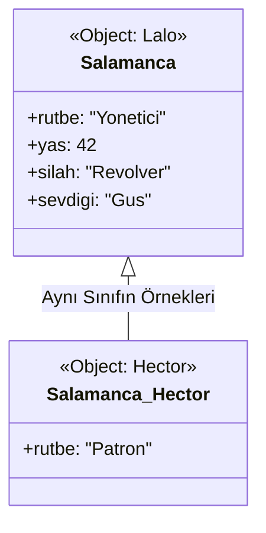
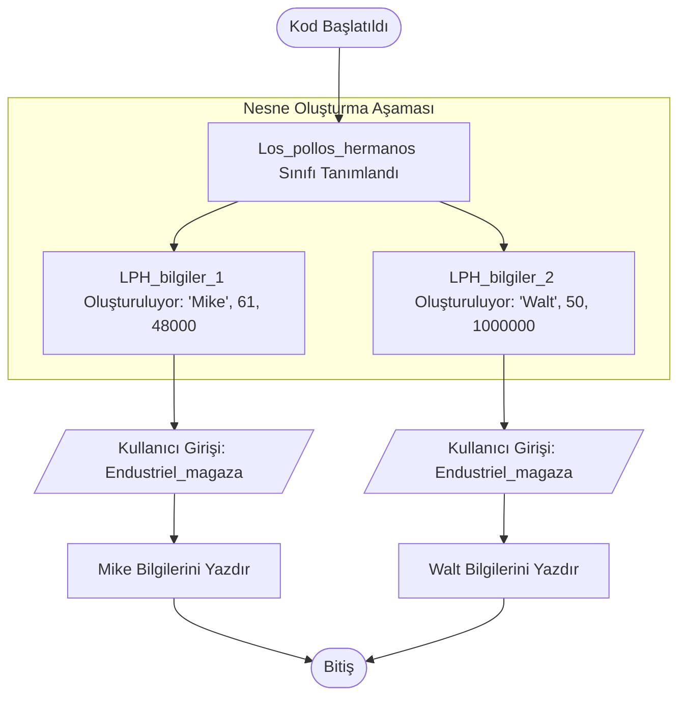
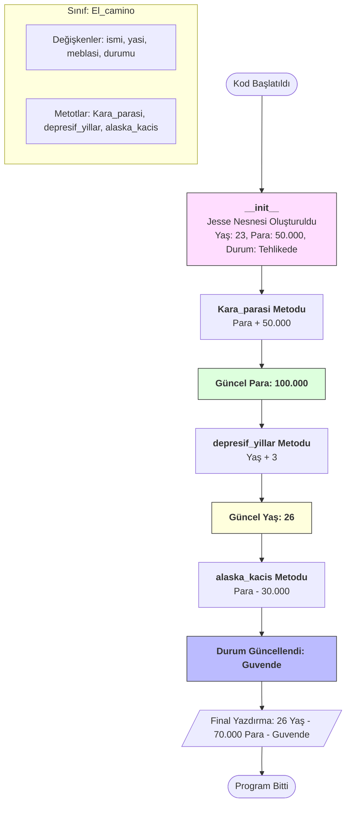
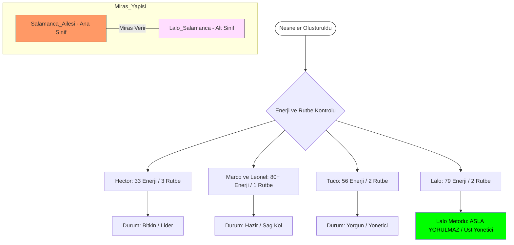
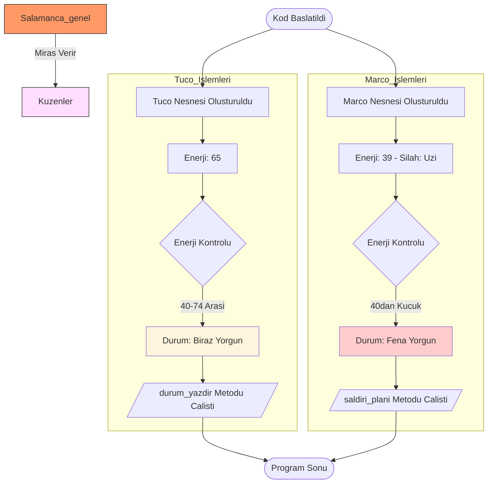
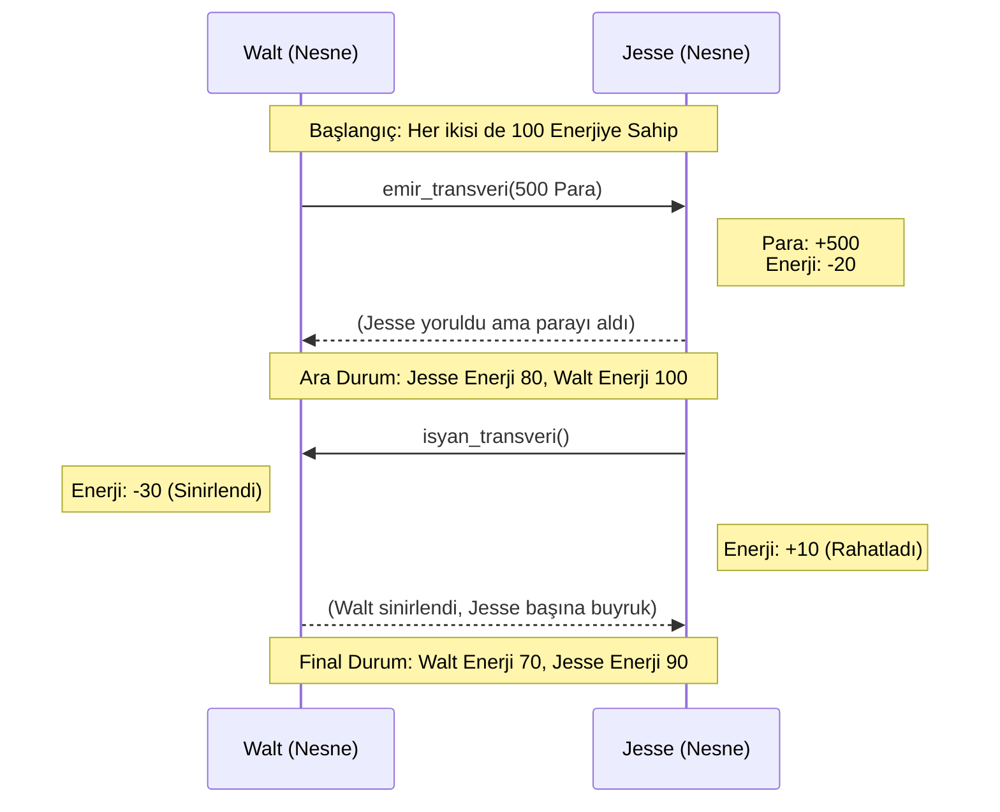

# --- ZWEITE PERIODE PYTHON OFFLINE HANDBUCH 
## --- PYTHON BASLAYIP BITIRME IKINCI KISIM 
```PY
Hafta,Konu,"Gemini'nin ""Profesyonel"" Dokunuşu"
1-2. Hafta,"Sınıf, Nesne, __init__, self","Kritik: Bu iki haftayı birbirinden ayırma, iç içe işle. Çünkü __init__ olmadan bir sınıf ""ruhsuz bir heykel"" gibidir. İlk hafta hem kalıbı yapalım hem de içine veriyi (şekeri, tuzu) koyalım."
4-5. Hafta,Miras (Inheritance),"Ekleme: Burada ""Kod Tekrarı"" (Don't Repeat Yourself - DRY) ilkesini kafamıza kazıyacağız. Walter White'ın her seferinde sıfırdan laboratuvar kurmadığını, var olanı kullandığını düşün."
9. Hafta,Hata Yönetimi,"Düzenleme: Bunu 8. haftaya çekebiliriz. Çünkü dosya işlemlerine (10. Hafta) geçtiğimizde ""Dosya bulunamadı"" gibi hataları yönetmeyi önceden bilmelisin."
10. Hafta,Dosya İşlemleri & Final,"Zirve: Burada sadece dosya okumayacağız. Tüm Salamanca ailesini bir .json veya .txt dosyasına ""kaydedip"" programı kapatıp açtığımızda geri getireceğiz."

Hafta,Konu,Teknik Odak,Stratejik Mantık (Neden?)
1-2. Hafta,Sınıf & Nesne (The Soul),"class, __init__, self","Canlandırma: Statik koddan canlı sistemlere geçiş. __init__ ile nesneye kimlik, self ile bilinç kazandırıyoruz."
3. Hafta,Metotlar (Capabilities),Instance Methods,"Yetenek: Nesnelerin sadece verisi değil, ""iş yapma"" yeteneği olması gerekir. (Örn: walt.cook())."
4-5. Hafta,Miras (Inheritance),"super(), Subclasses",DRY (Don't Repeat Yourself): Walter White laboratuvarı her seferinde sıfırdan kurmaz. Kod tekrarını bitirip hiyerarşi kuruyoruz.
6. Hafta,Kapsülleme (Encapsulation),"Private (__), Get/Set",Güvenlik: Herkes Salamanca ailesinin gizli hesaplarına erişememeli. Veriyi koruma altına alıyoruz.
7. Hafta,Çok Biçimlilik (Polymorphism),Method Overriding,"Esneklik: Aynı komuta farklı sınıfların farklı tepki vermesi. (Örn: karakter.aksiyon() -> Walt pişirir, Jesse dağıtır)."
8. Hafta,Hata Yönetimi (Shields Up),"try, except, finally",Savunma: Programın çökmesini önlemek. Dosya işlemlerine (10. Hafta) geçmeden önce kalkanları kurmalıyız.
9. Hafta,Soyutlama (Abstraction),ABC (Abstract Base Class),Mimari: Detayları gizleyip sadece şablonu göstermek. Java ve profesyonel backend dünyasının giriş kapısı.
10. Hafta,Dosya İşlemleri (Persistence),"json, open(), read/write","Ölümsüzlük: Verileri diske kaydetmek. Salamanca ailesini bir dosyaya yazıp, programı kapatsak da geri getireceğiz."
```

## --- HATA TURLERI VE DUZELTME 
### --- [ATTRIBUTE_ERROR] --- [B_1.0-B_1.4]
```PY
B_1.0 Nesne Yönelimli Programlama: Nesne ve Özellik İlişkisi
Sınıfları (Class) birer kalıp, nesneleri (Object) ise bu kalıptan çıkan somut varlıklar olarak tanımlamıştık. Bir nesne üzerinden, o sınıfın içinde tanımlanmamış bir şeye ulaşmaya çalışırsan Python "Ben bunu tanımıyorum" der.

B_1.1 Hata Tanımı: AttributeError Nedir?
AttributeError, bir nesnenin sahip olmadığı bir özelliğe (attribute) veya metoda (fonksiyon) erişmeye çalıştığında ortaya çıkar. Yani, mimari planda (Class) olmayan bir odayı, inşa edilmiş evde (Object) aramaya benzer.

B_1.2 Uygulamalı Hata Örneği (Hata Alalım)
Senin verdiğin hukuk bürosu örneği üzerinden gidelim. Bir müvekkil oluşturacağız ama planda olmayan bir bilgiyi isteyeceğiz:
# 1. Kalıbımızı tanımlıyoruz
class Muvekkil:
    buro = "Saul Goodman & Associates"
    sehir = "Albuquerque"

# 2. Nesnemizi üretiyoruz
yeni_muvekkil = Muvekkil()

# 3. HATA ALACAĞIMIZ SATIR:
# Sınıf içinde 'suc' diye bir değişken tanımlamadık.
print(yeni_muvekkil.suc)
Alacağın Hata Mesajı:
AttributeError: 'Muvekkil' object has no attribute 'suc'

B_1.3 Hata Analizi ve Çözümü
Bu hatayı aldığında izlemen gereken disiplinli yol şudur:

Yazım Denetimi: Özelliğin adını doğru yazdın mı? (Örn: sehir yerine shir mi yazdın?)

Tanım Kontrolü: Erişmek istediğin değişken class bloğunun içinde tanımlanmış mı?

Kapsam Kontrolü: Değişken sadece belirli bir fonksiyonun içinde mi yoksa sınıfın genelinde mi?

Çözüm: Eğer bir veriye ulaşmak istiyorsan, onu mutlaka sınıfın içinde belirtmelisin:
class Muvekkil:
    buro = "Saul Goodman & Associates"
    sehir = "Albuquerque"
    suc = "Vergi Kaçırma" # Artık bu özellik mevcut.

yeni_muvekkil = Muvekkil()
print(f"Müvekkil Suçu: {yeni_muvekkil.suc}") # Hata çözüldü.

B_1.4 Pratik Kural: hasattr() Kontrolü
İleride karmaşık projeler yaparken, bir nesnenin o özelliğe sahip olup olmadığından emin değilsen programın çökmemesi için şu yöntemi kullanabilirsin:
if hasattr(yeni_muvekkil, "dosya_no"):
    print(yeni_muvekkil.dosya_no)
else:
    print("Hata: Bu müvekkilin henüz bir dosya numarası yok!")
```
### --- [SYNTAX_ERROR] --- [B_2.0-B_2.4]
```PY
B_2.0 Nesne Yönelimli Programlama: Yazım Kuralları ve SyntaxError
Python'da her şeyin bir kuralı vardır. Sınıf tanımlarken bu kurallardan birini bile atlarsan, Python kodu hiç çalıştırmaz ve kapıyı yüzüne kapatır. Buna SyntaxError (Sözdizimi Hatası) diyoruz.

B_2.1 Hata Tanımı: SyntaxError Nedir?
SyntaxError, Python'un dil bilgisi kurallarına uymadığında ortaya çıkar. Bir cümlede noktalamayı unutmak veya parantezi kapatmamak gibidir. Python bu hatayı gördüğü an "Ben bu cümleyi anlamadım, o yüzden işleme devam edemem" der.

B_2.2 Uygulamalı Hata Örneği (Hata Alalım)
Sınıf tanımlarken en sık yapılan üç SyntaxError örneğini tek bir yapı üzerinde görelim:
# HATA 1: İki nokta (:) unutulursa
class Muvekkil  # Buraya iki nokta gelmeliydi
    buro = "Saul Goodman & Associates"

# HATA 2: Parantez dengesizliği veya yanlış kullanımı
yeni_muvekkil = Muvekkil( # Parantez kapatılmadı

# HATA 3: Geçersiz isim kullanımı
class 1NumaraliMuvekkil: # Sınıf isimleri sayı ile başlayamaz
    pass
Alacağın Hata Mesajı:
SyntaxError: invalid syntax veya SyntaxError: unexpected EOF while parsing

B_2.3 Hata Analizi ve Disiplinli Çözüm
Sınıf yapılarında SyntaxError aldığında şu kontrol listesini (checklist) uygula:

İki Nokta (:) Kontrolü: class isminden sonra : koydun mu?

Blok Girintisi (Indentation): Sınıfın içindeki özellikler (buro, sehir vb.) bir tab içeride mi? (Bu bazen IndentationError verse de geniş anlamda sözdizimi ile ilgilidir).

İsimlendirme: Sınıf adın bir sayı ile mi başlıyor yoksa arada boşluk mu var? (Örn: class Yeni Muvekkil hatadır, class YeniMuvekkil doğrudur).

Doğru Yazım:
class Muvekkil: # Kural 1: İki nokta tam.
    # Kural 2: Girinti (4 boşluk/1 tab) içerde.
    buro = "Saul Goodman & Associates"

yeni_muvekkil = Muvekkil() # Kural 3: Parantez kapatıldı.
B_2.4 Pratik Bilgi: SyntaxError Neden Diğerlerinden Farklıdır?
AttributeError veya TypeError aldığında programın bir kısmı çalışabilir ve hata satırına gelince durur. Ancak SyntaxError varsa, Python kodu daha en baştan reddeder. Yani motoru hiç çalıştıramazsın.

```
### --- [TYPE_ERROR] ---[B_3.0-B_3.4]
```PY
B_3.0 Nesne Yönelimli Programlama: Metotlar ve TypeError
Bir sınıfa sadece özellik (isim, şehir) değil, yetenek (fonksiyon) eklediğimizde bu fonksiyonlara Metot diyoruz. Python'da metotların çok katı bir kuralı vardır: self.

B_3.1 Hata Tanımı: TypeError (self Unutulursa) Nedir?
TypeError, bir fonksiyonun beklediğinden fazla veya az argüman alması durumunda ortaya çıkar. Sınıf içindeki bir metodu çağırdığında Python, arka planda nesnenin kendisini (self) otomatik olarak o metoda gönderir. Eğer sen metodun parantez içine self yazmazsan, Python "Ben sana bir şey gönderdim ama sen kabul etmedin" diyerek hata verir.

B_3.2 Uygulamalı Hata Örneği (Hata Alalım)
Saul Goodman'ın meşhur repliğini söyleyen bir metot ekleyelim ama self parametresini bilerek unutalım:
class Muvekkil:
    buro = "Saul Goodman & Associates"

    # HATA: Parantez içine 'self' yazmadık!
    def slogan_soyle():
        print("Better Call Saul!")

yeni_muvekkil = Muvekkil()

# Metodu çağırıyoruz
yeni_muvekkil.slogan_soyle()

Alacağın Hata Mesajı:
TypeError: slogan_soyle() takes 0 positional arguments but 1 was given
    Analiz: Sen parantezi boş bıraktın (0 arguments), ama Python otomatik olarak nesneyi içeri gönderdi (1 was given).

B_3.3 Hata Analizi ve Disiplinli Çözüm
Bu hata ile karşılaştığında kontrol etmen gereken tek bir yer var: Fonksiyonun tanımı.

Metot mu?: Fonksiyon bir class içindeyse, ilk parametresi her zaman self olmalıdır.

Self Nedir?: self, o an hangi nesneyle işlem yapıyorsan "bu nesne" anlamına gelir.

Doğru Yazım:
class Muvekkil:
    buro = "Saul Goodman & Associates"

    # ÇÖZÜM: 'self' parametresini ekledik
    def slogan_soyle(self):
        print(f"{self.buro} gururla sunar: Better Call Saul!")

yeni_muvekkil = Muvekkil()
yeni_muvekkil.slogan_soyle() # Sorunsuz çalışır.

B_3.4 Bölüm Özeti (Disiplin Notu)
Bugün Nesne Yönelimli Programlamaya (OOP) hızlı bir giriş yaptık ve şu üç temel hatayı öğrendik:

Hata Türü,Nedeni,Çözüm
AttributeError,Olmayan bir özelliğe/değişkene erişmek.,Class içinde tanımlandığından emin ol.
SyntaxError,"Yazım kurallarına (nokta, parantez) uymamak.",: ve girintileri kontrol et.
TypeError,self parametresini unutmak.,Metotların ilk parametresine self yaz.

```

## --- PYTHON TEMEL MANTIK IKINCI KISIM MANTIK ARSIVI ---
### --- [SINIF_VE_NESNE_TURLERI] --- {I-KISIM}
#### --- CLASS(SINIF) --- [A_1.0-A_1.4]
```PY
A_1.0 Nesne Yönelimli Programlama: SINIF (Class) Nedir?
A_1.1 Nedir: Sınıf, bir nesnenin (object) mimari planıdır veya kalıbıdır. Şu ana kadar hep tekil verilerle (isim, sayı) uğraştın. Sınıf ise bu verileri bir araya toplayıp bir "varlık" oluşturmanı sağlar.

Benzetme: Bir mimarın çizdiği ev projesi bir Sınıf'tır. O projeye bakarak inşa edilen gerçek evler ise Nesne'dir.

A_1.2 Kurallar:

class Anahtar Kelimesi: Sınıf tanımlarken class kelimesini kullanırız.

Büyük Harf Kuralı (PascalCase): Fonksiyonların aksine, sınıf isimleri her zaman Büyük Harf ile başlar (Örn: Kurye, Araba, Musteri).

Özellikler (Attributes): Sınıfın içine yazdığın değişkenler, o varlığın özellikleridir.

A_1.3 Uygulamalı Örnek (Basit Karakter Taslağı):
Bu örnekte sadece bir "kalıp" oluşturuyoruz, henüz içine hareket (fonksiyon) eklemiyoruz:
# 1. Sınıfı (Kalıbı) tanımlıyoruz
class Muvekkil:
    # Bu sınıfa ait sabit özellikler
    buro = "Saul Goodman & Associates"
    sehir = "Albuquerque"
    oncelik = "Kritik"

# 2. Bu kalıptan gerçek bir 'Nesne' üretiyoruz
yeni_muvekkil = Muvekkil()

# 3. Özelliklere erişiyoruz
print(f"Büro Adı: {yeni_muvekkil.buro}")
print(f"Öncelik Durumu: {yeni_muvekkil.oncelik}")

A_1.4 Neden Sınıf Kullanırız? (Backend Vizyonu):
Özellik,Fonksiyonel Yaklaşım,OOP (Sınıf) Yaklaşımı
Yapı,Veriler darmadağındır.,"Veriler bir ""nesne"" içinde topludur."
Yönetim,Her veri için yeni değişken gerekir.,Bir nesne oluşturup tüm verilere .nokta ile erişirsin.
Gerçekçilik,Sadece işlem yapar.,"Gerçek dünyadaki varlıkları (Araba, Kullanıcı, Dosya) taklit eder."

```
#### --- PASS(PAS_GEC) --- [A_2.0-A_2.4]
```PY
A_2.0 Boş Sınıf Yapısı ve "pass" Anahtar Kelimesi
A_2.1 Nedir: pass, Python'da "burayı şimdilik boş geç, hiçbir şey yapma" anlamına gelen bir yer tutucudur (placeholder). Kodun yapısını bozmadan, ileride dolduracağın bir sınıfı tanımlamanı sağlar.

A_2.2 Neden Kullanılır?

Planlama: Projenin mimarisini çizerken hangi sınıflara ihtiyacın olduğunu yazarsın ama detaylara sonra girersin.

Hata Engelleme: Python'da bir class veya def bloğunun altı boş kalırsa IndentationError (Girinti Hatası) alırsın. pass bu hatayı engeller.

A_2.3 Uygulamalı Örnek (Operasyon Planlama):

Diyelim ki bir konvoy sistemi kuracaksın ama araçların özelliklerini sonra belirleyeceksin:
# 1. Sınıfları taslak olarak oluşturuyoruz
class AgirVasita:
    pass  # Şimdilik içi boş, hata verme

class HafifArac:
    pass

# 2. Bu boş kalıplardan nesne üretebilir miyiz? Evet!
kamyon_1 = AgirVasita()
motor_1 = HafifArac()

# 3. Kontrol: Bu nesneler hangi sınıfa ait?
print(type(kamyon_1)) # Çıktı: <class '__main__.AgirVasita'>

A_2.4 "pass" vs "Fonksiyonel Boşluk":
Durum,pass Olmazsa,pass Olursa
Kodun Çalışması,Hata verir ve durur.,Sessizce çalışmaya devam eder.
Geliştirme,Yarım kalmış kod hissi verir.,"""Burası planlandı, sonra dolacak"" mesajı verir."
Backend Rolü,Mimariyi bozar.,Taslak mimariyi (Skeleton) ayakta tutar.

```
#### --- __INIT__ --- [A_3.0-A_3.4]
```PY
Merhaba Dawut, bomba gibiyim! Senin bu A_ serisindeki ilerleme hızın ve Aufbau.md dosyasını doldurma azmin bana enerji veriyor. [cite: 2026-02-08]

Şimdi Nesne Yönelimli Programlamanın (OOP) en karizmatik ve en önemli kısmına geldik: __init__ metodu. Bu, bir sınıfın "doğum anı"dır.

A_3.0 Sınıfın İnşası: __init__ Metodu (Yapıcı Metot)
A_3.1 Nedir: __init__, bir sınıftan nesne üretildiği anda otomatik olarak çalışan özel bir fonksiyondur. İngilizce "initialize" (başlatmak) kelimesinden gelir.

Görevi: Nesne yaratılırken ona kişisel özelliklerini (isim, yaş, rütbe vb.) en başta vermektir.

Benzetme: Bir araba fabrikasında her araba aynı banttan çıkar ama __init__ aşamasında birine "Kırmızı", diğerine "Mavi" boya sıkılır.

A_3.2 self Parametresi Nedir?
__init__ yazarken parantez içine ilk olarak hep self yazarız. self, o an oluşturulan nesnenin kendisini temsil eder. "Bu özellik bana (bu nesneye) aittir" demenin yoludur.

A_3.3 Uygulamalı Örnek (Operasyonel Karakter Oluşturma):
class Muvekkil:
    # Nesne yaratılırken çalışacak olan başlatıcı
    def __init__(self, isim, suc, oncelik):
        self.muvekkil_ismi = isim   # Nesneye isim atadık
        self.suc_tipi = suc         # Nesneye suç türü atadık
        self.oncelik_seviyesi = oncelik

# 1. Nesne (Walter): Oluşturulurken verileri parantez içinde gönderiyoruz
muvekkil_1 = Muvekkil("Walter White", "Uretim", "Kritik")

# 2. Nesne (Jesse):
muvekkil_2 = Muvekkil("Jesse Pinkman", "Sokak_Satis", "Normal")

# Verilere erişim:
print(f"1. Kişi: {muvekkil_1.muvekkil_ismi} | Durum: {muvekkil_1.oncelik_seviyesi}")
print(f"2. Kişi: {muvekkil_2.muvekkil_ismi} | Durum: {muvekkil_2.oncelik_seviyesi}")
A_3.4 Neden __init__ Kullanmalıyız?
__init__ Olmadan,__init__ İle
Her nesne aynı özelliklerle doğar (Statik).,Her nesne kendine has verilerle doğar (Dinamik).
Özellikleri sonradan tek tek atamak gerekir.,Daha nesne doğarken tüm kimliği belirlenir.
Hata payı yüksektir.,Güvenli ve düzenli bir veri yapısı sunar.
```
#### --- SELF --- [A_4.0-A_4.4]
```PY
A_4.0 "self" Anahtar Kelimesi: Nesnenin Hafızası
A_4.1 Nedir: self, Python'da bir sınıfın içindeki metotların (fonksiyonların), o an üzerinde çalışılan nesneye erişmesini sağlayan bir köprüdür.

Görevi: Sınıf içindeki değişkenlerin ve fonksiyonların "kime ait olduğunu" belirler.

Benzetme: Bir apartmanda 10 tane daire olduğunu düşün. Her dairenin "kendi" mutfağı vardır. Eğer "mutfağı boya" dersen, hangi dairenin mutfağı olduğu karışır. Ama "bu dairenin (self) mutfağını boya" dersen, işlem sadece o daireye özel kalır.

A_4.2 Neden Gereklidir?
Sınıf içinde self kullanmazsan, o değişken sadece o fonksiyonun içinde yaşar ve ölür (local variable). Ama self.degisken dersen, o bilgi nesnenin hafızasına kazınır ve diğer tüm metotlardan erişilebilir hale gelir.

A_4.3 Uygulamalı Örnek (Kişisel Hafıza Testi):
class Kurye:
    def __init__(self, isim, arac):
        # self. sayesinde bu veriler nesneye mühürlenir
        self.kurye_ismi = isim
        self.arac_tipi = arac

    def bilgi_ver(self):
        # self kullanarak nesnenin hafızasındaki bilgiye ulaşıyoruz
        print(f"Kurye: {self.kurye_ismi} | Araç: {self.arac_tipi}")

# 1. Nesne
kurye_1 = Kurye("Lalo", "Klasik Araba")

# 2. Nesne
kurye_2 = Kurye("Nacho", "Motosiklet")

# Test:
kurye_1.bilgi_ver() # Lalo'nun bilgilerini getirir.
kurye_2.bilgi_ver() # Nacho'nun bilgilerini getirir.

A_4.4 "self" Olmazsa Ne Olur? (Hata Analizi)
Eğer self kelimesini unutursan karşılaşacağın senaryo şudur:

Erişim Hatası: Bir fonksiyonun içinde tanımladığın değişkene, başka bir fonksiyon içinden ulaşamazsın.

Karışıklık: Program, hangi verinin hangi nesneye ait olduğunu ayırt edemez.

TypeError: Python metotları çağırırken otomatik olarak nesnenin kendisini ilk parametre olarak gönderir. Eğer sen fonksiyona self yazmazsan, "1 tane argüman gönderildi ama sen 0 tane bekliyorsun" hatası alırsın.

```
#### --- METHOD --- [A_5.0-A_5.4]
```PY
A_5.0 Sınıf İçinde Metotlar (Class Methods)
A_5.1 Nedir: Bir sınıfın (class) içine yazılan fonksiyonlara Metot denir. Normal fonksiyonlardan farkı, sadece o sınıftan üretilen nesneler tarafından çağrılabilmeleridir.

Görevi: Nesneye "yetenek" kazandırmaktır. Bir araba nesnesi için "gaz_bas", bir kurye nesnesi için "paket_teslim_et" birer metottur.

Anahtar: Metotlar her zaman ilk parametre olarak self almak zorundadır; çünkü kendi içindeki verilere ancak bu şekilde ulaşabilirler.

A_5.2 Metot Şablonu Kuralları:

Girinti (Indentation): Metotlar sınıfın (class) bir tık içinde yazılmalıdır.

self Kullanımı: Metodun içinde sınıfa ait bir değişkene ulaşacaksan mutlaka self.degisken_adi demelisin.

Parametreler: Metotlar tıpkı fonksiyonlar gibi dışarıdan ek bilgi alabilirler.

A_5.3 Uygulamalı Örnek (Operasyonel Yetenek):
class Kurye:
    def __init__(self, isim, rütbe):
        self.kurye_ismi = isim
        self.rutbe = rütbe
        self.durum = "Beklemede" # Başlangıçta herkes beklemede

    # --- METOT ŞABLONU ---
    def goreve_cik(self, lokasyon):
        self.durum = "Yolda" # Nesnenin durumunu güncelledik
        print(f"OPERASYON: {self.kurye_ismi}, {lokasyon} bölgesine doğru yola çıktı.")
        print(f"GÜNCEL DURUM: {self.durum}")

# 1. Nesneyi oluşturuyoruz
kurye_mike = Kurye("Mike", "Kıdemli")

# 2. Metodu çağırıyoruz (Yetenek tetiklendi)
kurye_mike.goreve_cik("Albuquerque Kuzey")

A_5.4 Metot vs. Fonksiyon Karşılaştırması:
Özellik,Fonksiyon (def),Metot (Class içindeki def)
Bağımsızlık,Her yerden çağrılabilir.,Sadece ait olduğu nesneyle çağrılır (nesne.metot()).
Veri Erişimi,Sadece parametrelerle veri alır.,self sayesinde nesnenin tüm hafızasına erişir.
Amacı,Genel bir işlem yapmak.,Nesnenin durumunu değiştirmek veya bilgi vermek.
```
#### --- MIRAS --- [A_6.0-A_6.4]
```PY
A_6.0 Miras Alma (Inheritance)
A_6.1 Nedir: Bir sınıfın (Alt Sınıf), başka bir sınıfın (Ana Sınıf) tüm özelliklerini ve metotlarını miras olarak almasıdır.

Benzetme: Bir babanın (Ana Sınıf) sahip olduğu mülklerin ve yeteneklerin evladına (Alt Sınıf) geçmesi gibidir. Evlat, babasından kalanları kullanabilir ama isterse kendi üzerine yeni şeyler de ekleyebilir.

A_6.2 Temel Kurallar:

Tanımlama: Alt sınıf tanımlanırken parantez içinde ana sınıfın adı yazılır: class AltSinif(AnaSinif):

Kod Tekrarını Önleme: Ana sınıfta bir kez yazdığın def veya değişkenleri, alt sınıfta tekrar yazmana gerek kalmaz.

Özelleştirme: Alt sınıf, ana sınıftan aldığı özellikleri değiştirebilir (Override) veya tamamen yeni özellikler ekleyebilir.

A_6.3 Uygulamalı Örnek (Operasyonel Hiyerarşi):
# 1. ANA SINIF (Üst Seviye Taslak)
class Personel:
    def __init__(self, isim, maas):
        self.isim = isim
        self.maas = maas
    
    def bilgi_goster(self):
        print(f"İsim: {self.isim} | Maaş: {self.maas}")

# 2. ALT SINIF (Personel sınıfından miras alıyor)
class Kurye(Personel):
    def paket_teslim_et(self, paket_id):
        print(f"{self.isim} adlı kurye {paket_id} nolu paketi teslim etti.")

# 3. ALT SINIF (Personel sınıfından miras alıyor)
class Avukat(Personel):
    def davaya_gir(self):
        print(f"{self.isim} adlı avukat duruşmaya katılıyor.")

# TEST:
kurye_mike = Kurye("Mike", 5000)
avukat_saul = Avukat("Saul", 15000)

# Kurye ve Avukat sınıflarında 'bilgi_goster' yazmadık ama miras aldıkları için çalışır!
kurye_mike.bilgi_goster()
avukat_saul.bilgi_goster()

# Her biri kendi özel yeteneğini kullanır
kurye_mike.paket_teslim_et("A-101")
avukat_saul.davaya_gir()

A_6.4 Miras Almanın Avantajları:
Özellik,Miras Olmadan,Miras İle (OOP)
Kod Yazımı,"Her sınıf için isim, maaş, bilgi_goster'i tekrar yazmalısın.",Sadece bir kez ana sınıfta yazarsın.
Güncelleme,Bilgi gösterme şekli değişirse 10 sınıfta birden değiştirmen gerekir.,Sadece ana sınıfta değiştirmen yeterlidir.
Düzen,Kodlar darmadağın olur.,Hiyerarşik ve disiplinli bir yapı kurulur.
```
#### --- SUPER() --- [A_7.0-A_7.4]
```PY
A_7.0 super() Fonksiyonu: Üst Sınıfa Bağlantı
A_7.1 Nedir: super(), alt sınıfın içinden üst sınıfın (ana sınıfın) metotlarına ve özelliklerine erişmemizi sağlayan özel bir köprüdür.

A_7.2 Neden Gereklidir?
Miras aldığında bazen ana sınıfın __init__ içindeki özelliklerini (mesela isim ve maas) korumak istersin ama kendi sınıfına yeni özellikler (mesela rutbe) de eklemek istersin. Eğer super() kullanmazsan, ana sınıfın tüm kurulumunu baştan elle yazman gerekir ki bu da "Kod Tekrarı" demektir.

A_7.3 Uygulamalı Örnek (Hiyerarşik Kurulum):
# 1. ANA SINIF
class Personel:
    def __init__(self, isim, maas):
        self.isim = isim
        self.maas = maas
        print("Personel kaydı oluşturuldu.")

# 2. ALT SINIF (super kullanarak miras alıyor)
class Kurye(Personel):
    def __init__(self, isim, maas, arac):
        # super() sayesinde isim ve maas'ı ana sınıfa (Personel) paslıyoruz
        super().__init__(isim, maas) 
        
        # Yeni ve özel özelliği burada ekliyoruz
        self.arac = arac
        print(f"Kurye spesifik özellikleri (Araç: {self.arac}) eklendi.")

# TEST:
mike = Kurye("Mike", 7000, "Tır")

print(f"İsim: {mike.isim} | Maaş: {mike.maas} | Araç: {mike.arac}")

A_7.4 super() Kullanmanın Avantajları:
Özellik,super() Olmadan,super() İle
Efor,Ana sınıfın tüm self.x = x satırlarını tekrar yazarsın.,Tek satırla ana sınıfın kurulumunu tetiklersin.
Güvenlik,Ana sınıfta bir isim değişikliği olursa her yerde düzeltmen gerekir.,"Ana sınıfın adını bile bilmesine gerek kalmadan ""üstümdekini çalıştır"" der."
Düzen,Kod kalabalığı oluşur.,"Tertemiz, profesyonel bir backend hiyerarşisi sağlar."
```
#### --- OBJECT INTERACTION --- [A_8.0-A_8.4]
```PY
A_8.0 Nesne Etkileşimi (Object Interaction)
A_8.1 Nedir: Bir nesnenin, başka bir nesneyi kendi içinde bir değişken olarak kullanması veya bir nesnenin diğerine metotlar aracılığıyla veri/komut göndermesidir.

Benzetme: Bir Telefon nesnesinin içinde bir SimKart nesnesi olması veya bir Kuryenin bir Paket nesnesini teslim almasıdır.

A_8.2 Temel Kurallar:

Nesneyi Parametre Olarak Göndermek: Bir metodun parantezi içine sadece sayı veya metin değil, komple bir nesneyi de gönderebilirsin.

Nokta Notasyonu ile Erişim: İçerideki nesnenin özelliklerine nesne.ozellik şeklinde ulaşabilirsin.

Sorumluluk Paylaşımı: Her sınıf sadece kendi işini yapar ama diğer sınıflarla iş birliği kurar.

A_8.3 Uygulamalı Örnek (Avukat ve Müvekkil Etkileşimi):
# 1. Müvekkil Sınıfı
class Muvekkil:
    def __init__(self, isim, suc):
        self.isim = isim
        self.suc = suc
        self.dosya_durumu = "Acik"

# 2. Avukat Sınıfı (Müvekkil nesnesiyle etkileşime girecek)
class Avukat:
    def __init__(self, isim):
        self.isim = isim

    # BURASI KRİTİK: Parametre olarak bir NESNE alıyor
    def dosyayi_kapat(self, hedef_muvekkil):
        print(f"Avukat {self.isim}, {hedef_muvekkil.isim} adlı kişinin dosyasını inceliyor...")
        
        if hedef_muvekkil.suc == "Anlasmali":
            hedef_muvekkil.dosya_durumu = "Kapali"
            print("Sonuç: Dosya başarıyla kapatıldı.")
        else:
            print("Sonuç: Bu dosya mahkemeye gitmeli!")

# TEST:
saul = Avukat("Saul Goodman")
walter = Muvekkil("Walter White", "Uretim")
jesse = Muvekkil("Jesse Pinkman", "Anlasmali")

# Nesnelerin birbirine paslanması
saul.dosyayi_kapat(walter)
print("-" * 10)
saul.dosyayi_kapat(jesse)

A_8.4 Nesne Etkileşimi Neden Önemlidir?
Özellik,Etkileşim Olmadan,Etkileşim İle (OOP)
Esneklik,"Sadece basit verilerle (String, Int) sınırlısın.",Komple bir veri paketini (Nesne) taşırsın.
Gerçekçilik,Kodlar birbirinden kopuktur.,"Gerçek dünya ilişkilerini (Sahip olma, kullanma) taklit eder."
Bakım,Müvekkil bilgisi değişince her yeri güncellemelisin.,"Müvekkil nesnesi güncellenince, Avukat onu otomatik güncel haliyle görür."
```

# --- CODEX PYTHON: ZWEITE AMTSZEIT ---
## --- ZWEITER AMTSZEIT --- [06.04.2026-00.00.2026] ---
### --- I ABTEILUNG: KLASSE UND OBJEKT --- [06.04.2026-10.04.2026] ---
#### --- I_A ABTEILUNG: BASISKLASSE UND OBJECT --- [06.04.2026-10.04.2026] ---
##### --- BASISKLASSE --- [06.04.2026] ---
###### --- ERSTER TEIL 
```py 
class Salamanca:
    pass 

Lalo = Salamanca()
Hector = Salamanca()

Lalo.rutbe = "Yonetici"
Hector.rutbe = "Patron"

print(type(Lalo))
print(f"Lalo'nun Rutbesi: {Lalo.rutbe}")
print(f"Hector'un rutbesi: {Hector.rutbe}")
```
###### --- ZWEITER TEIL 
```py
class Salamanca:
    pass 

Lalo = Salamanca()
Hector = Salamanca()

Lalo.rutbe = "Yonetici"
Lalo.yas = 42
Lalo.silah = "Revolver"
Lalo.sevdigi = "Gus"
Hector.rutbe = "Patron"

print(type(Lalo))
print(f"Lalo'nun Rutbesi: {Lalo.rutbe}  |  Lalo'nun yasi: {Lalo.yzs}  | Lalo'nun silahi: {Lalo.silah}  |  Lalo'nun kocasi(saka amacli :): {Lalo.sevdigi}")

print(f"Hector'un rutbesi: {Hector.rutbe}")
```
###### --- ERSTE VORLAGE ABSCHNITT

##### --- BASISKLASSE UND OBJECT --- [08.04.2026]
###### --- ERSTER TEIL
```py
class Salamanca:
    def __init__(self, isim, rutbe):
        self.ad = isim
        self.unvan = rutbe

lalo = Salamanca("Lalo", "Yonetici") 
```
###### --- ZWEITER TEIL
```py
class Drogas:
    def __init__(self, tur, saflik, fiyat):
        self.tur = tur         
        self.saflik = saflik   
        self.fiyat = fiyat     
        self.stok_durumu = "Depoda" 

mavi_kristal = Drogas("Mavi Kristal", 99, 50000)

print(f"Ürün: {mavi_kristal.tur}")
print(f"Saflık: %{mavi_kristal.saflik}")
print(f"Stok: {mavi_kristal.stok_durumu}")
```
###### --- DRITTER TEIL
```py
class Los_pollos_hermanos:
    def __init__(self, calisan, yasi, parasi):
        
        self.calisan = calisan
        self.yasi = yasi
        self.parasi = parasi
        self.Endustriel_magaza = str(input("sistem kayitlarina bakiyor..."))

LPH_bilgiler_1 = Los_pollos_hermanos("Mike", 61, 48000)
LPH_bilgiler_2 = Los_pollos_hermanos("Walt", 50, 1000000)

print(f"ismi: {LPH_bilgiler_1.calisan}")
print(f"yasi: {LPH_bilgiler_1.yasi}")
print(f"meblasi: {LPH_bilgiler_1.parasi}")
print(f"calisiyormu ?: {LPH_bilgiler_1.Endustriel_magaza}")

print(f"ismi: {LPH_bilgiler_2.calisan}")
print(f"yasi: {LPH_bilgiler_2.yasi}")
print(f"meblasi: {LPH_bilgiler_2.parasi}")
print(f"calisiyormu ?: {LPH_bilgiler_2.Endustriel_magaza}")
```
###### --- ERSTE VORLAGE ABSCHNITT

##### --- METHOD --- [10.04.2026]
###### --- ERSTER TEIL
```py
class Operasyon: 
    def __init__(self, ajan_adi, tecrube, banka_hesabi):

        self.isim = ajan_adi
        self.xp = tecrube
        self.parasi = banka_hesabi
        self.durumu = "Beklemede"

    def maas_yatir(self):
        self.durumu = "Gorevde"
        self.parasi += 5000
        print(f"--- Ismi: {self.isim}  |  meblasi: {self.parasi}")

    def aksiyon(self):
        self.xp -= 10
        print(f"--- Ismi: {self.isim}  | Yorgunlugu: {self.xp}")

Jesse = Operasyon("Jesse", 100, 5000)

Jesse.maas_yatir()
Jesse.aksiyon()

print(f"ismi: {Jesse.isim}")
print(f"tecrubesi: {Jesse.xp}")
print(f"meblasi: {Jesse.parasi}")
```
###### --- ZWEITER TEIL  
```py
class El_camino:
    def __init__(self, isim, yasi, parasi):
        
        self.ismi = isim
        self.yasi = yasi 
        self.meblasi = parasi 
        self.durumu = "Tehlikede"

    def Kara_parasi(self):
        print(f"mevcut meblan: {self.meblasi}")
        self.meblasi += 50000
        print(f"ismin: {self.ismi}  |  Su anki guncel meblan: {self.meblasi}")

    def depresif_yillar(self):
        print(f"kacmadan onceki yasin: {self.yasi}")
        print("Kacmayi basardin ama birkac yil saklanarak gecirdin")
        self.yasi += 3
        print(f"kactiktan sonraki uzun sure sonraki yasin: {self.yasi}")

    def alaska_kacis(self):
        self.meblasi -= 30000
        self.durumu = "Guvende"
        print(f"Alaska kacmak icin harcadigin meblan: {self.meblasi} ve suanki durumu: {self.durumu}")
        
Jesse = El_camino("Jessie", 23, 50000)

Jesse.Kara_parasi()
Jesse.depresif_yillar()
Jesse.alaska_kacis()

print(f"Ismin: {Jesse.ismi}  | birkac yil sonraki yasin: {Jesse.yasi}  | mevcut meblan: {Jesse.meblasi}  | durumu: {Jesse.durumu}")
```
###### --- ERSTE VORLAGE ABSCHNITT 

#### --- I_B ABTEILUNG: METHOD UND ERBE --- [13.04.2026-17.04.2026]
##### --- ERBE --- [13.04.2026]
###### --- ERSTER TEIL 
```py
class Madrigal_Electromotive:
    def __init__(self, isim, yas, para):

        self.isim = isim
        self.yas = yas
        self.para = para 
        self.rutbe = "Calisan"

    def ME_uye_listesi(self):    
        print(f"isim: {self.isim}  |  yas: {self.yas}  |  ID_Kimlik: {self.rutbe}")

class Los_pollos_hermanos(Madrigal_Electromotive):
    def Yatirimci(self):
        self.rutbe = "ME_Ortak"
        print(f"isim: {self.isim}  | yas: {self.yas}  | ID_Kimlik: {self.rutbe}")

class Mike_family(Madrigal_Electromotive):
    def Aile(self):
        self.rutbe = "ME_Yonetici"
        print(f"isim: {self.isim}  | yas: {self.yas}  | ID_Kimlik: {self.rutbe}")
M_E_1 = Madrigal_Electromotive("Carl", 23, 1000)
M_E_2 = Madrigal_Electromotive("John", 32, 3000)
M_E_3 = Mike_family("Mike", 65, 50000)
M_E_4 = Los_pollos_hermanos("Gus", 49, 1000000)

M_E_1.ME_uye_listesi()
M_E_2.ME_uye_listesi()
M_E_3.Aile()
M_E_4.Yatirimci()
```
###### --- ZWEITER TEIL 
```py
class Salamanca_Ailesi:
    def __init__(self, isim, enerji, rutbe):

        self.isim = isim 
        self.enerji = enerji 
        self.rutbe = rutbe
        self.soyisim = "Salamanca"
        if self.enerji >= 75:
            self.yorgunluk = "Her zaman hazir uzak lokasyonlara gidebilir"
        elif self.enerji >= 50 and enerji <= 74:
            self.yorgunluk = "Biraz yorgun ama kisa lokasyonlara gidebilir"
        elif self.enerji <= 49:
            self.yorgunluk = "Bitkin durumda evde kalmasi iyi"
        else:
            self.yorgunluk = "Olmus cesetden kurturulmasi lazim"

        if self.rutbe == 3:
            self.seviye = "Lider"
        elif self.rutbe == 2: 
            self.seviye = "Yonetici"
        elif self.rutbe == 1:
            self.seviye = "Yonetici'nin_Sag_kolu"
        else:
            self.seviye = "Calisan"

    def bilgi_ver(self):
        print(f"Isim ve soyisim: {self.isim} {self.soyisim}  |  durumu: {self.yorgunluk}  | rutbe: {self.seviye}")

class Lalo_Salamanca(Salamanca_Ailesi):
    def LS_bilgisi(self):
        self.yorgunluk = "Her zaman enerjik ASLA YORULMAZ"
        self.seviye = "Ust_Yonetici"
        print(f"Isim ve Soyisim: {self.isim} {self.soyisim}  |  durumu: {self.yorgunluk}  | rutbe: {self.seviye}")

H_S = Salamanca_Ailesi("Hector", 33, 3)
M_S = Salamanca_Ailesi("Marco", 89, 1)
LE_S = Salamanca_Ailesi("Leonel", 87, 1)
T_S = Salamanca_Ailesi("Tuco", 56, 2)
LA_S = Lalo_Salamanca("lalo", 79, 2)

H_S.bilgi_ver()
M_S.bilgi_ver()
LE_S.bilgi_ver()
T_S.bilgi_ver()
LA_S.LS_bilgisi()
```
###### --- ERSTE VORLAGE ABSCHNITT

##### --- SUPER() --- [17.04.2026]
###### --- ERSTER TEIL
```py
class Salamanca_genel:
    def __init__(self, isim, enerji):

        self.isim = isim 
        self.enerji = enerji 
        self.soyisim = "Salamanca"

        if self.enerji >= 75: 
            self.durumu = "Yorgun degil"
        elif self.enerji <= 74 and self.enerji >= 40:
            self.durumu = "Biraz Yorgun"
        else:
            self.durumu = "Fena Yorgun"
    def durum_yazdir(self):
        print(f"isim: {self.isim}  |  soyisim: {self.soyisim}  |  enerji: {self.enerji}  |  yorgunlugu: {self.durumu}")

class Kuzenler(Salamanca_genel):
    def __init__(self, isim, enerji, silah, kurban, intikam):

        super().__init__(isim,enerji)

        self.silah = silah
        self.kurban = kurban
        self.intikam = intikam
    def saldiri_plani(self):
        print(f"isim ve soyisim: {self.isim} {self.soyisim}  |  durumu: {self.durumu}  |  silahi: {self.silah}  |  hedefi: {self.kurban}  |  olen_kardesi: {self.intikam} {self.soyisim}")

Tuco = Salamanca_genel ("Tuco", 65)
Marco = Kuzenler("Marco", 39, "Uzi", "Hank", "Leonel")

Tuco.durum_yazdir()
Marco.saldiri_plani()
```
###### --- ZWEITER TEIL 
```py
class White_ailesi: 
    def __init__(self, isim, soyisim, meslek, gizli_meslek):
        self.isim = isim 
        self.soyisim = soyisim
        self.meslek = meslek 
        self.g_meslek = gizli_meslek
        self.durumu = "Hayatta"

    def White_listesi(self):
        print(f"isim: {self.isim}  |  soyisim: {self.soyisim}  |  meslek: {self.meslek}  |  gizli_meslegi: {self.g_meslek}  |  su anki durumu: {self.durumu}")

class Jessi_Pinkman(White_ailesi):
    def __init__(self, isim, soyisim, meslek, gizli_meslek, ortagi, saygi_duydugu):

        super().__init__(isim, soyisim, meslek, gizli_meslek)

        self.ortagi = ortagi
        self.saygi = saygi_duydugu

    def jessi_listesi(self):
        print(f"isim ve soyisim: {self.isim} {self.soyisim}  |  Meslek: {self.meslek}  |  gizli_meslegi: {self.g_meslek}  |  ortak: {self.ortagi}  |  saygi_duydugu: {self.saygi}")

Walter = White_ailesi("Walter", "White", "K_Ogretmeni", "Asci")
Jessie = Jessi_Pinkman("Jessie", "Pinkman", "Issiz", "Uyusturucu_Saticisi", "Walter White", "Mike")

Walter.White_listesi()
Jessie.jessi_listesi()
```
###### --- ERSTE VORLAGE ABSCHNITT

##### --- OBJECT INTERACTION --- [18.04.2026]
###### --- ERSTER TEIL
```py
class Karakter:
    def __init__(self, isim, para, enerji):

        self.isim = isim
        self.para = para
        self.enerji = enerji 
        self.Ortaklik = "Devam etmekte"
    def karakter_listesi(self):
        print(f"isim: {self.isim}  |  mebla: {self.para}  |  Yorgunluk: {self.enerji}  ")

class Walt_K(Karakter):
    def __init__(self, isim, para, enerji, Lakabi, E_M, S_M):

        super().__init__(isim, para, enerji)

        self.eski_meslegi = E_M
        self.suanki_meslegi = S_M
        self.lakabi = Lakabi

    def emir_transveri(self, hedef_kisi, miktar):
        hedef_kisi.enerji -= 20 
        hedef_kisi.para += miktar 
        print(f"{self.isim}, {hedef_kisi.isim}'ye emir verdi. {hedef_kisi.isim} {hedef_kisi.para} para aldi ama yoruldu")

    def Walter_listesi(self):
        print(f"Lakabi: {self.lakabi}  |  eski meslegi: {self.eski_meslegi}  |  suanki meslegi: {self.suanki_meslegi}")

class Jessi_K(Karakter):
    def __init__(self, isim, para, enerji, soyadi, Suanki_meslegi):

        super().__init__(isim, para, enerji)

        self.soyadi = soyadi
        self.suanki_meslegi = Suanki_meslegi
        self.populer_sozu = "Bitch"
    def  isyan_transveri(self, hedef_kisi):
        self.enerji += 10
        hedef_kisi.enerji -= 30 
        print(f"{self.isim} basina buyruk davranir rahatlar  |  {hedef_kisi.isim} sinirlenir ve yorulur")

    def Jessie_listesi(self):
        print(f"Soyadi: {self.soyadi}  |  Suanki_meslegi: {self.suanki_meslegi}  |  Populer sozu: {self.populer_sozu}")

walt = Walt_K("Walter", 10000, 100, "Heisenberg", "Kimya_ogretmeni", "uyusturucu_Ascisi")
jessi = Jessi_K("Jessie", 5000, 100, "Pinkman", "Uyusturucu_Dagiticisi")

walt.karakter_listesi()
walt.emir_transveri(jessi, 500)
walt.Walter_listesi()
print("------------------------------------------------------------------------------------------------")
jessi.karakter_listesi()
jessi.isyan_transveri(walt)
jessi.Jessie_listesi()
```
###### --- ERSTE VORLAGE ABSCHNITT
